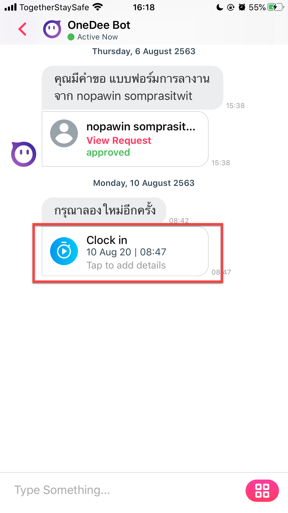
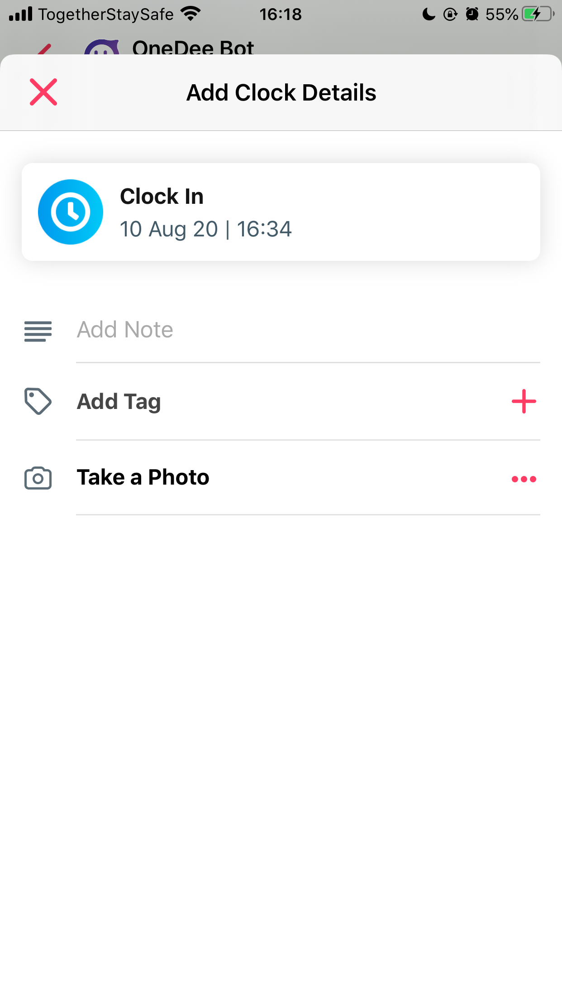

# Adding details with time clocking

* **After the completion of time clocking. Can click on Time stamp information According to the red frame as in the picture To add details Attached to time stamp information**

**Can add various details attached to the time stamp as follows**

* Add Note = General description details
* Add Tag = Tag to show your job title, team you are in. \(It depends on the admin of the company to create it.\)
* Take a Photo = Can add a photo for further confirmation.

