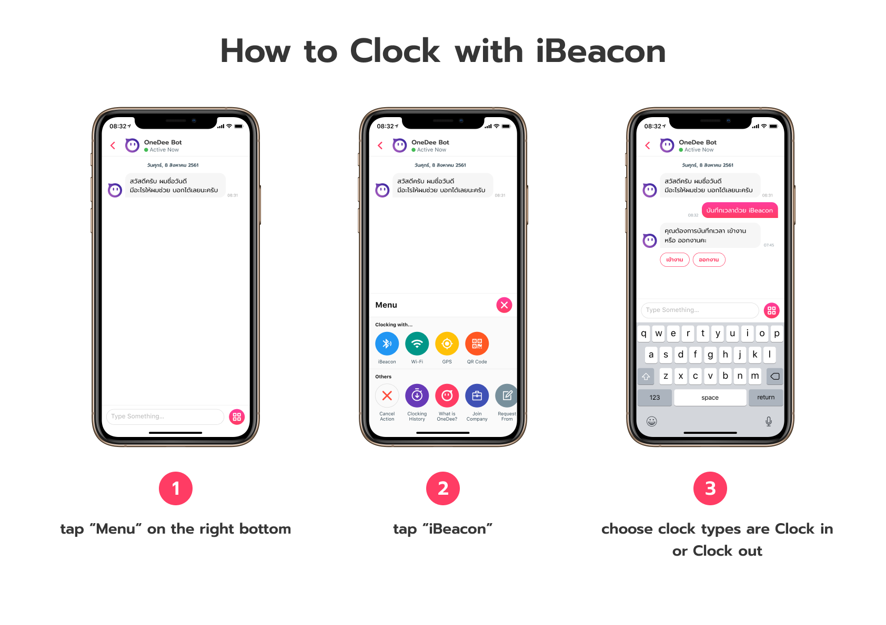
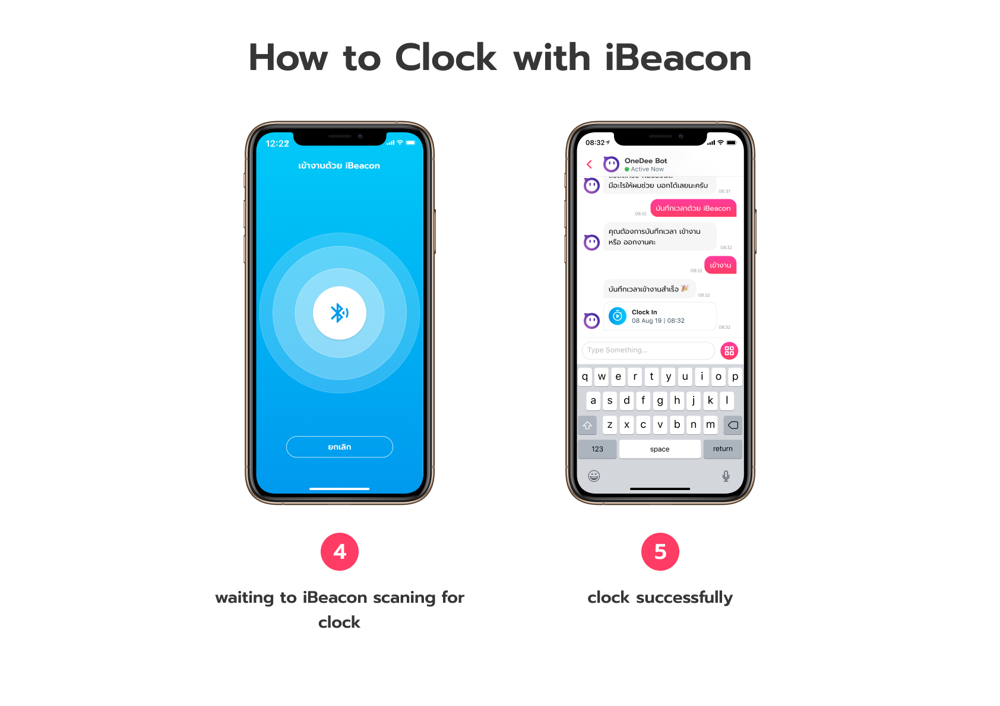
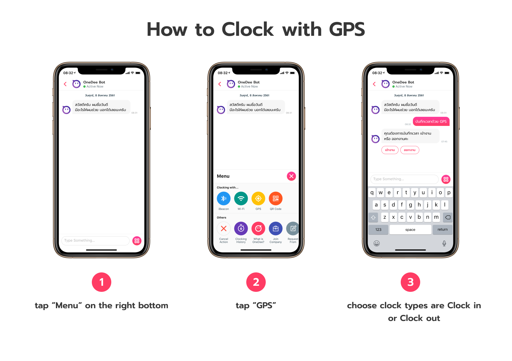
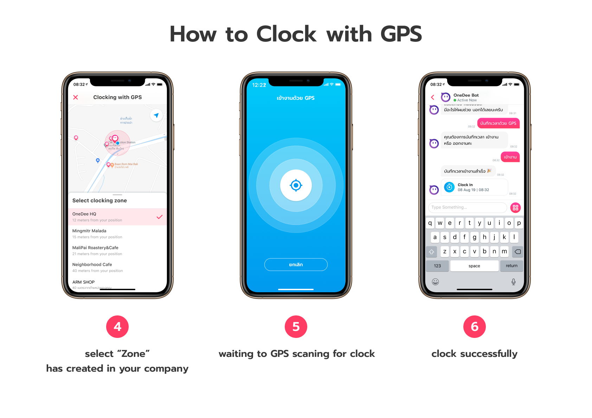
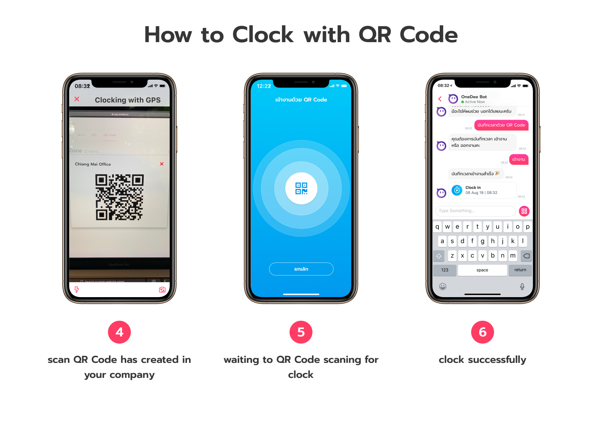

# How to Clock in/ out

You can clock with OneDee X has **4** types

* iBeacon 
* Wi-Fi 
* GPS 
* QR Code

## How to Clock with iBeacon



## How to Clock with Wi-Fi



## How to Clock with GPS



## How to Clock with QR Code



## How to talk with Bot for Clock in

* Go to "**Chat Bot OneDee**"
* Type message **"Clock in"**
* Select **Zone type**

## How to talk with Bot for Clock out

* Go to "**Chat Bot OneDee**"
* Type message **"Clock out"**
* Select **Zone type**

