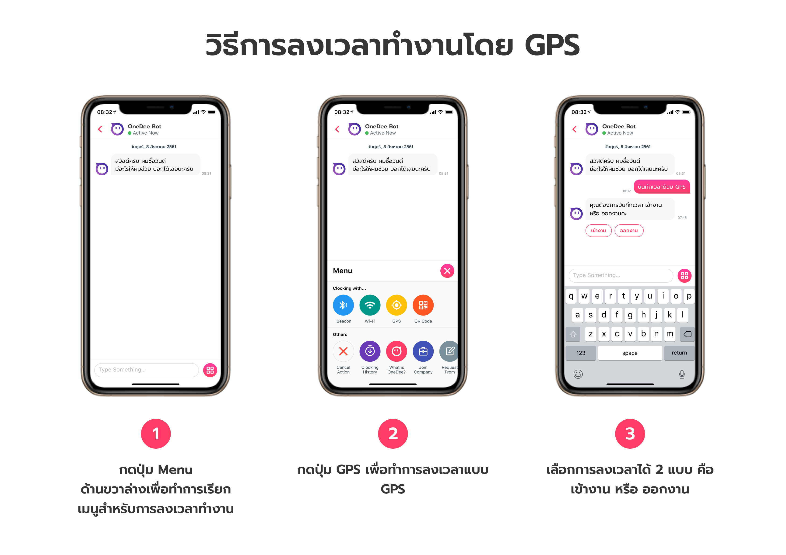

# วิธีการลงเวลาเข้างาน-เลิกงาน

การลงเวลาของ OneDee X มีทั้งหมด **4** รูปแบบ ดังนี้

* iBeacon 
* Wi-Fi 
* GPS 
* QR Code











## ขั้นตอนการลงเวลาเข้างาน

* เข้าหน้า "**Chat Bot OneDee**"
* พิมพ์ข้อความว่า "**เข้างาน**"
* เลือก **จุดลงเวลาที่ต้องการเข้างาน**

## ขั้นตอนการลงเวลาเลิกงาน

* เข้าหน้า "**Chat Bot OneDee**"
* พิมพ์ข้อความว่า "**เลิกงาน**"
* เลือก **จุดลงเวลาที่ต้องการเข้างาน**

