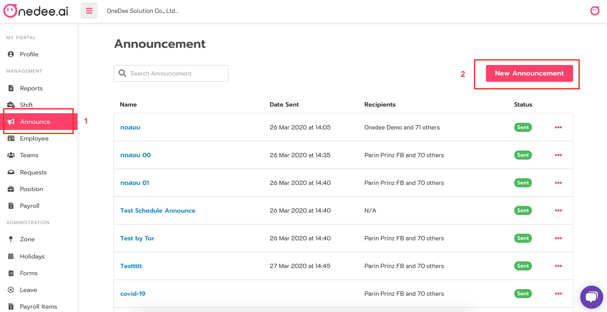
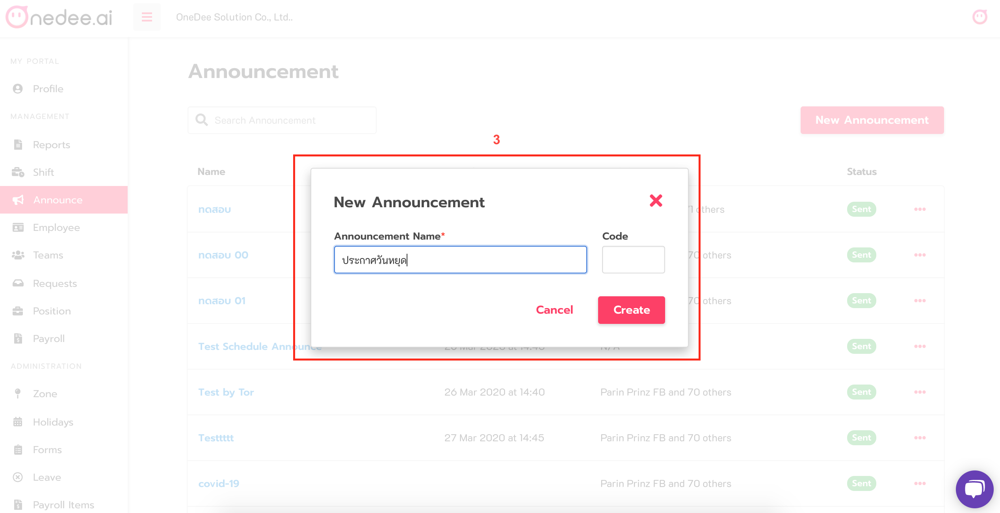
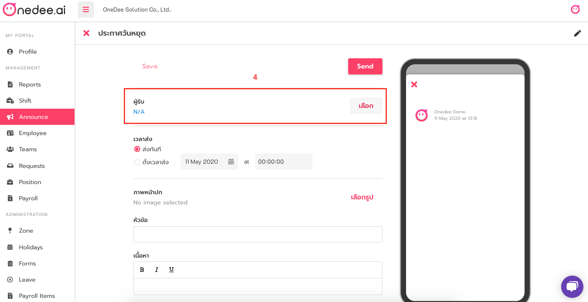
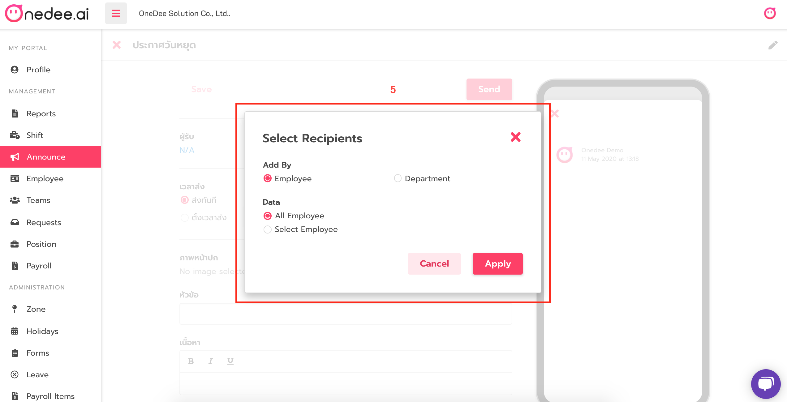
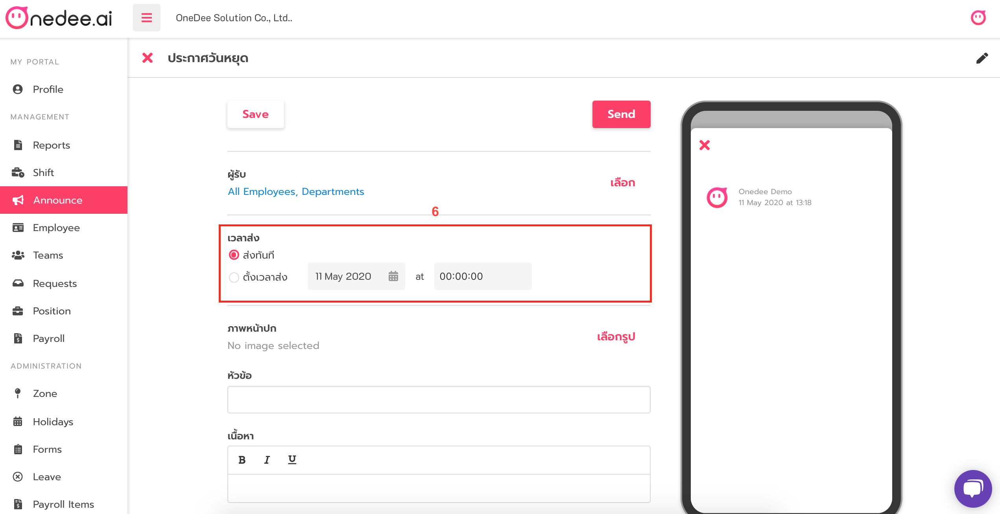
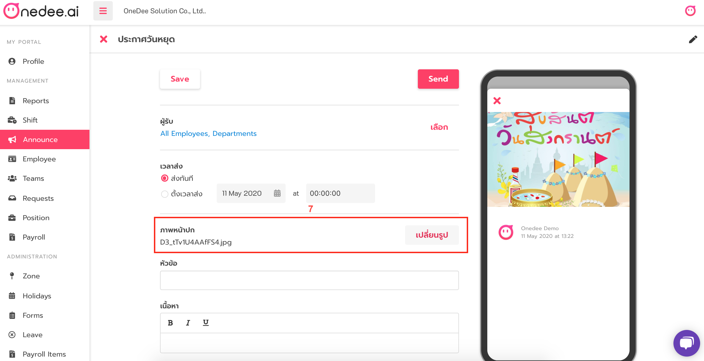
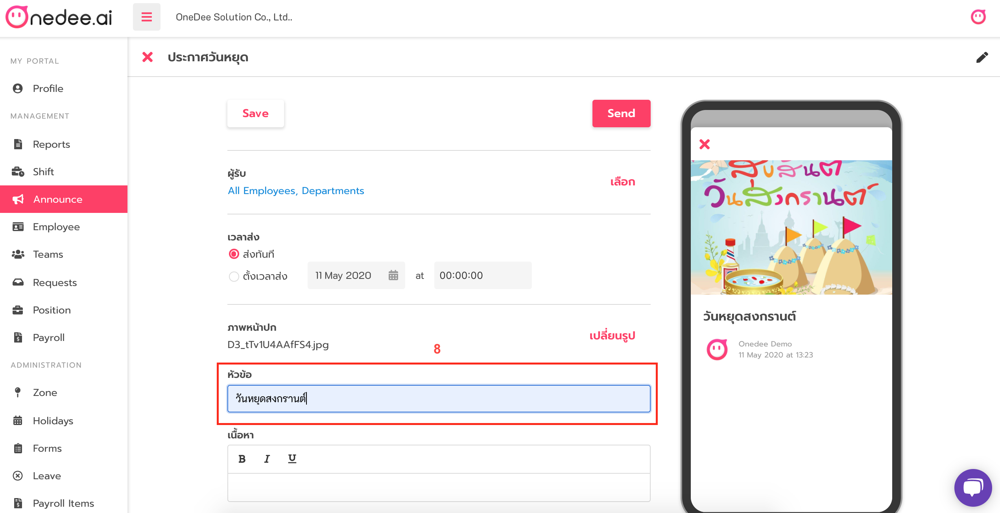
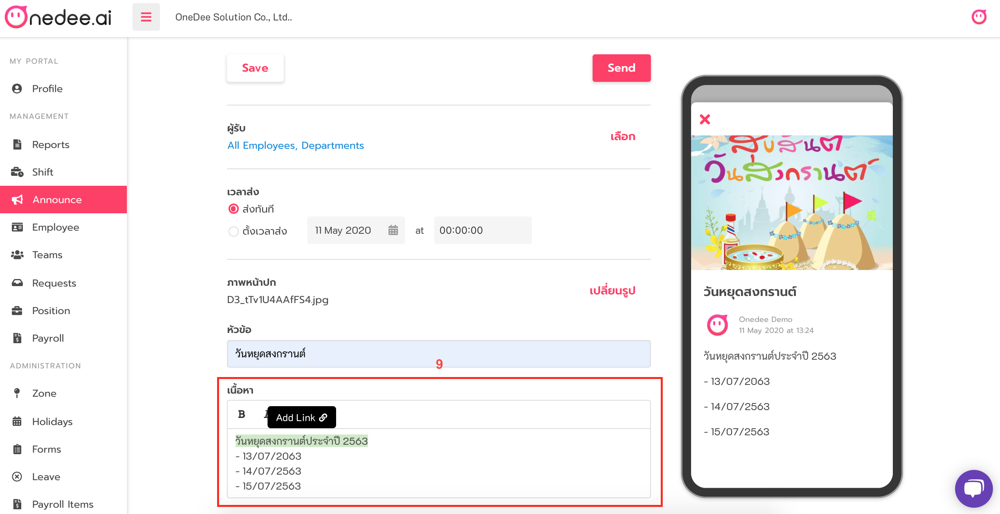
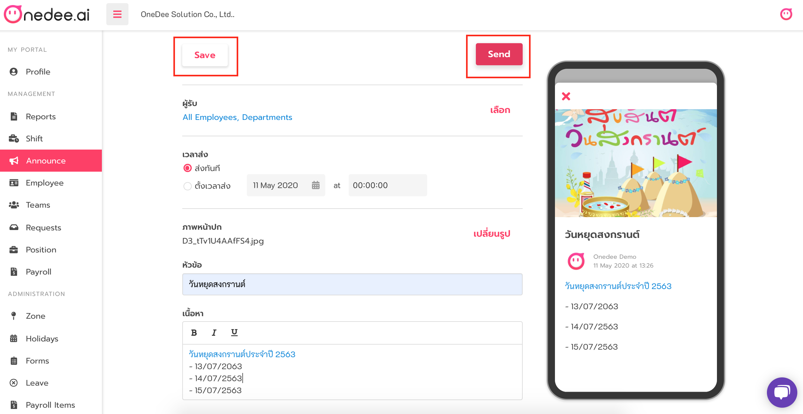

# How to manage Announce

* Go to **Announce Menu**
* Click **New Announcement** to create announce

* Enter **Announcement Name**
* Enter **Code** \(option\)
* Click **Create** 

* Click **Recipients**
* Select **Add by** and **Data**
* Click **Apply**

* Set **Date send**

* Set **Time send**

* Import **image** 

* Enter **Title Name**

* Enter **your details** \(add link or select text style\)

* Click **Save** to save this announcement
* Click **Send** for send this announcement to your recipients

