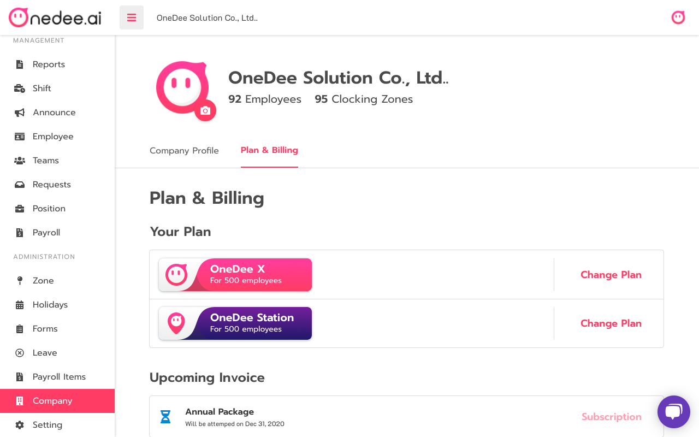
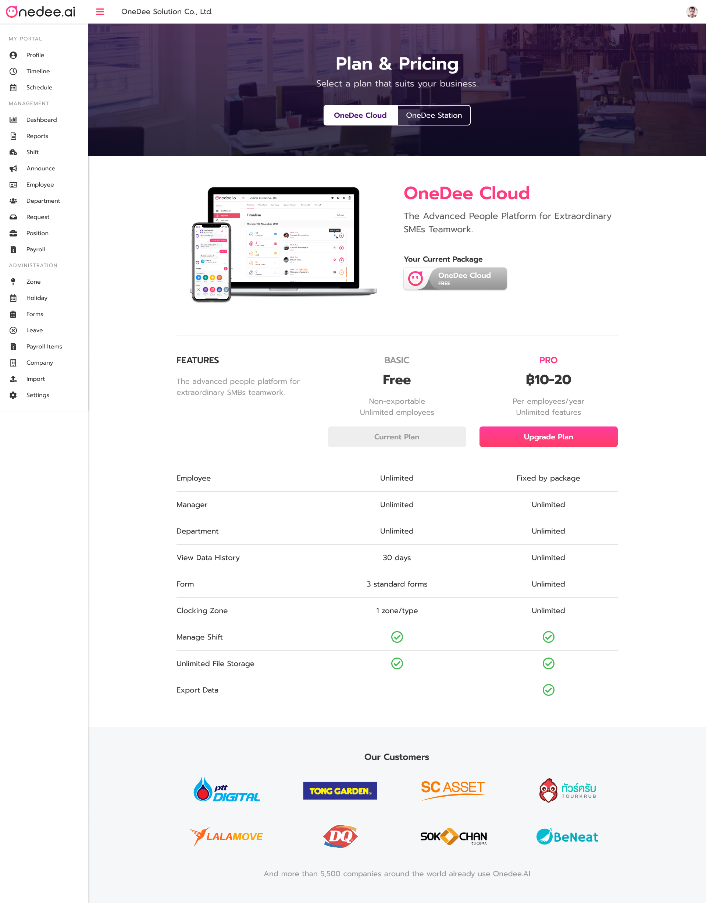
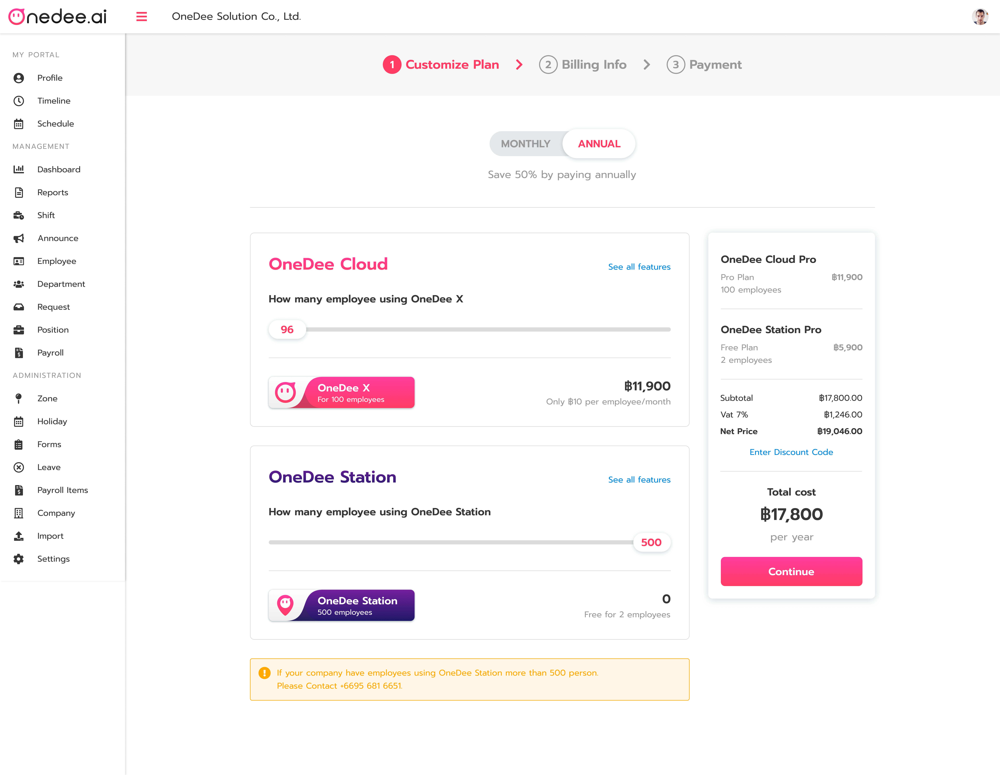
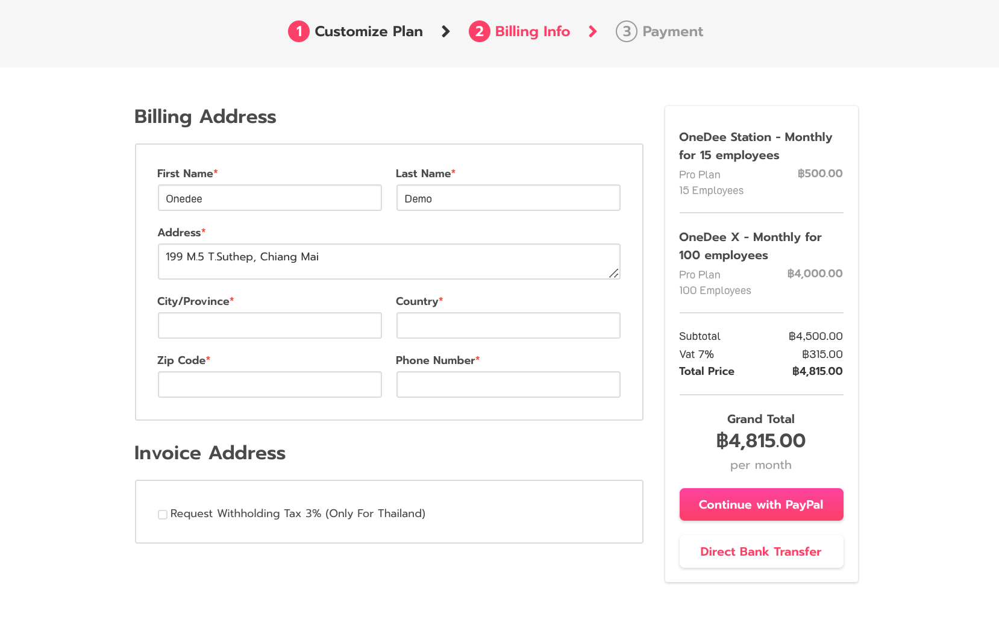
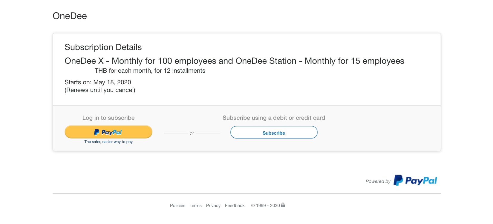
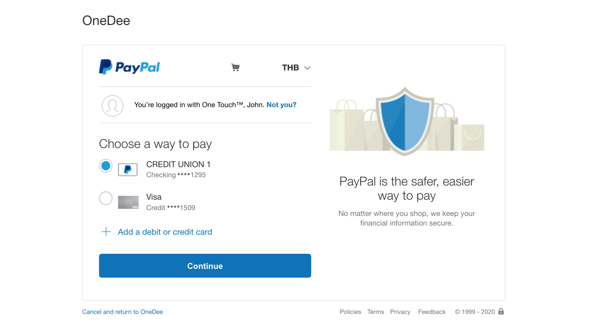
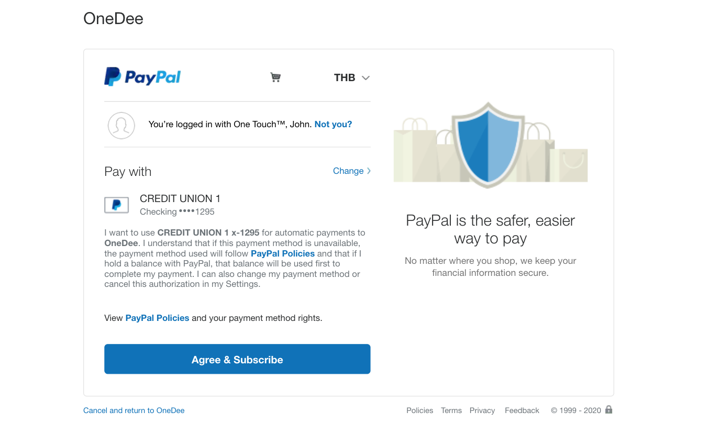
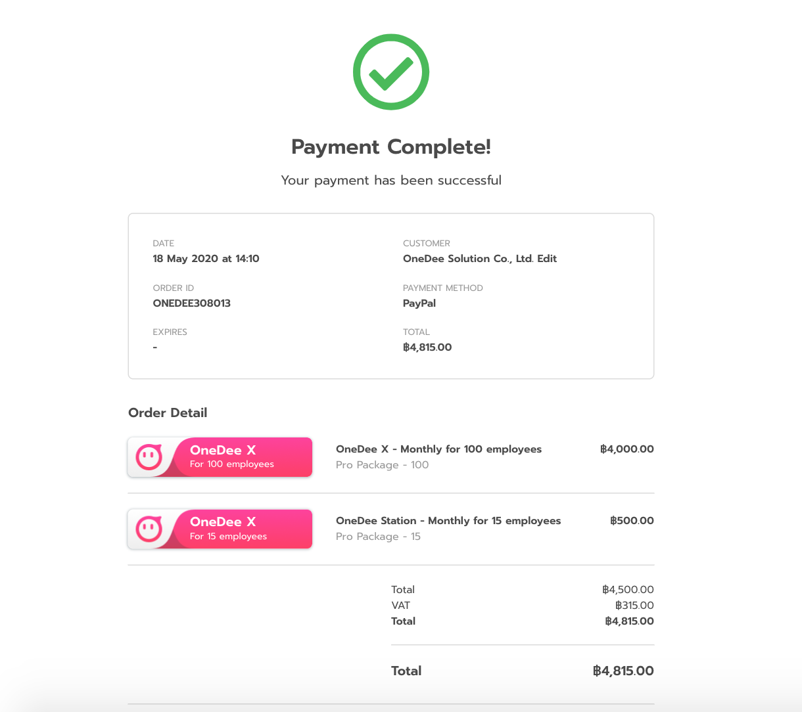

# Plan & Billing

## How to Upgrade Plan

* Go to **Company Menu**
* Select **Plan & Billing**
* Click **Change Plan**

* Click **Upgrade Plan**

* Select **Amount of employee**
* Click **Continue**

## How to pay via PayPal

* Enter **Billing Address**
* Click **Continue with PayPal**

* Click **PayPal**

* Click Continue

* Click **Agree & Subscribe**

* **Payment Complete!**

## How to pay via Direct Bank Transfer

* Enter **Billing Address**
* Click **Direct Bank Transfer**

Bangkok Bank, Muang Thong Thani Branch,  
Account no. **931-00-7679-0** **OneDee Solution Co., Ltd.**   
And send proof of payment at line: **@onedee** or email: **success@onedee.ai**

