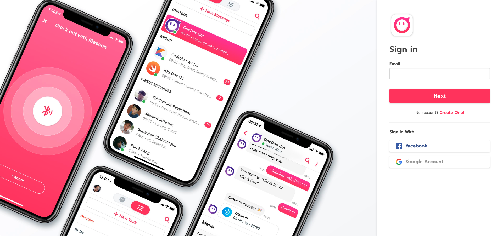
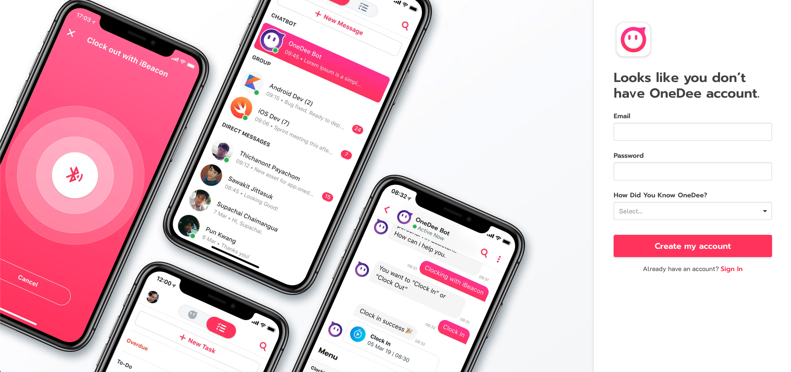
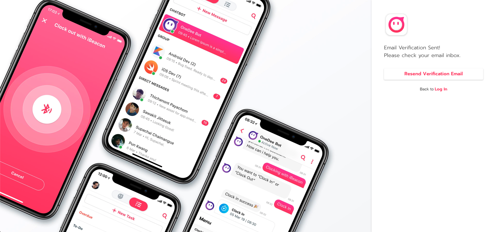
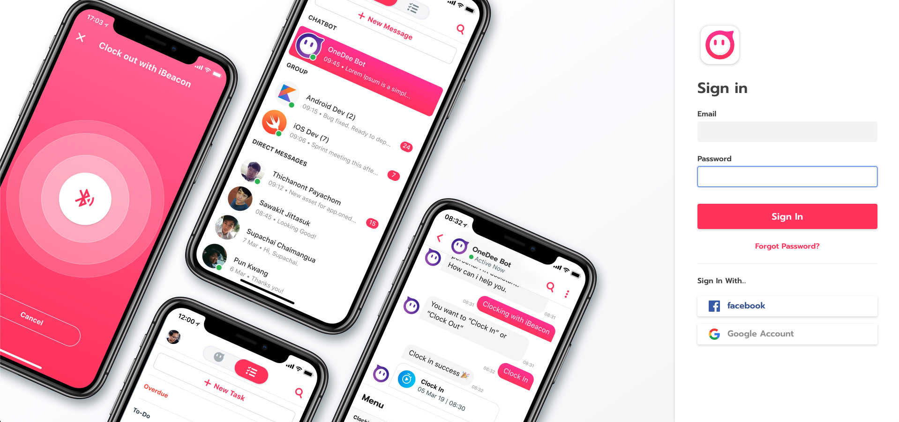

# How to create new Account



## How to register

* go to  [**https://app.onedee.ai**](https://app.onedee.ai)

* Click **Create One**
* Enter **Email,** **Password** and select answer for **How Did You Know OneDee?**
* Click **Create My Account**

* Email verification will send to your email 

After verified

* Back to [https://app.onedee.ai](https://app.onedee.ai)  
* Enter **Email** 
* Click **Next** 
* Enter **Password**
* Click **Sign In**

