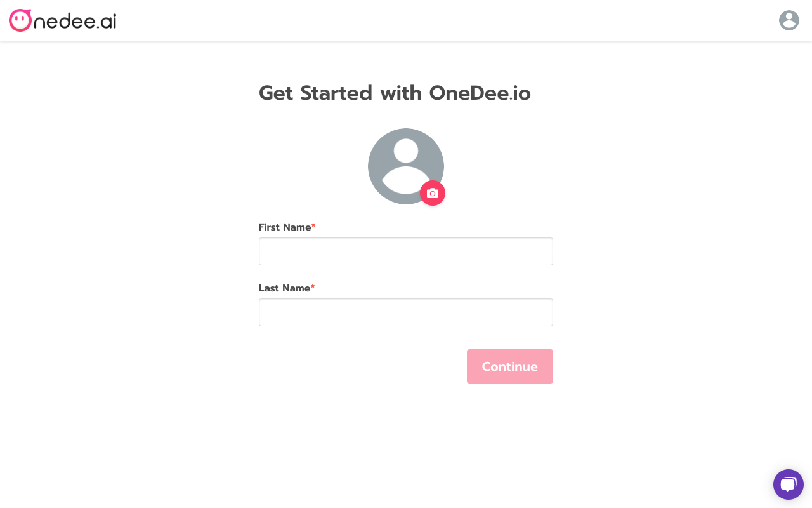
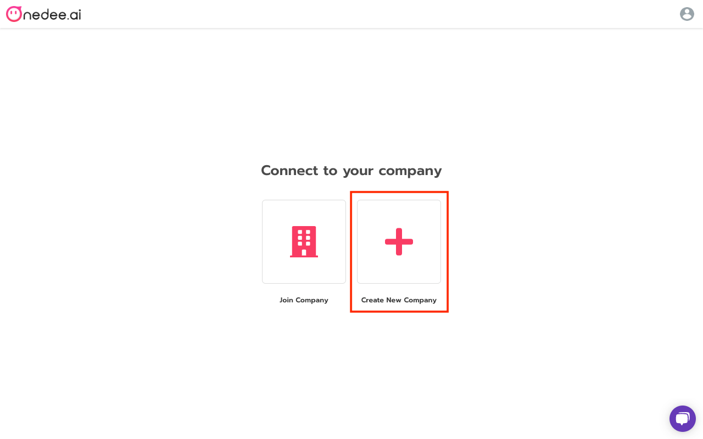
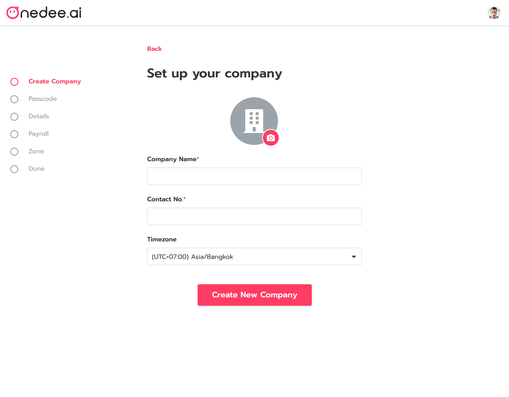
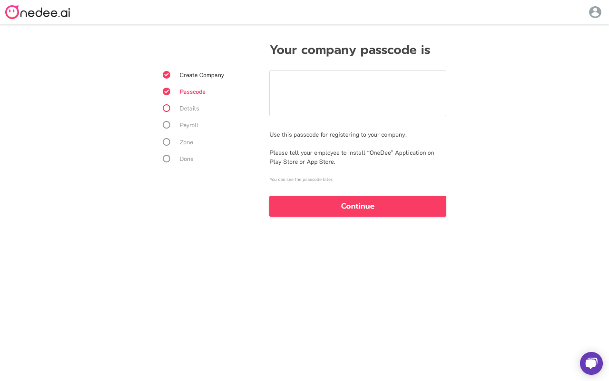
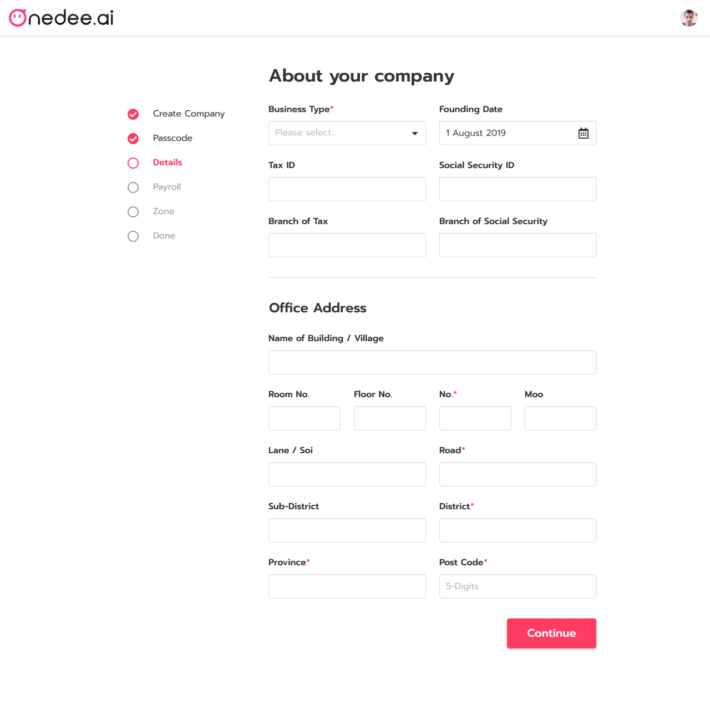
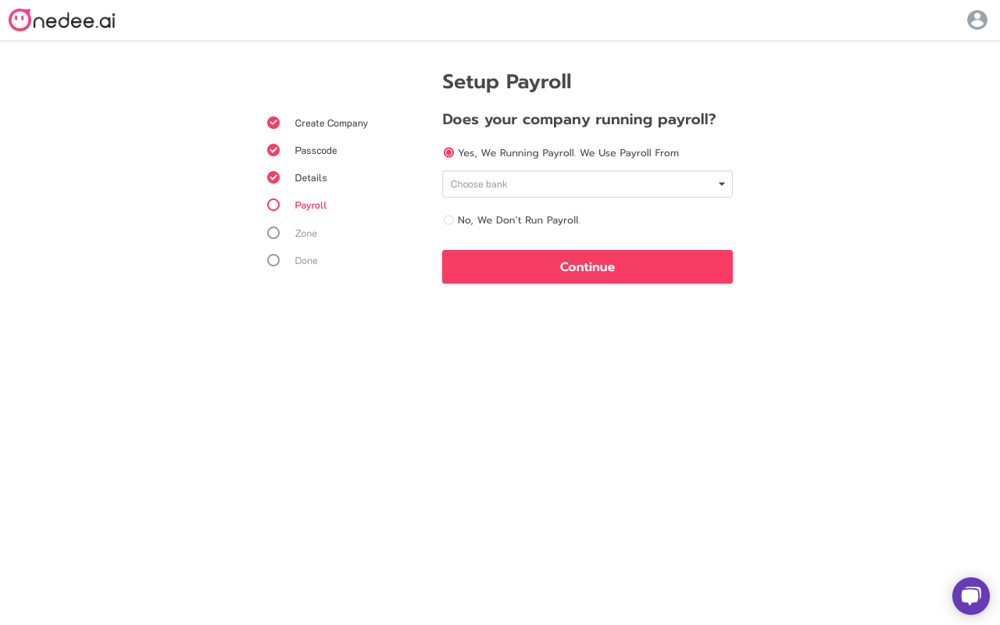
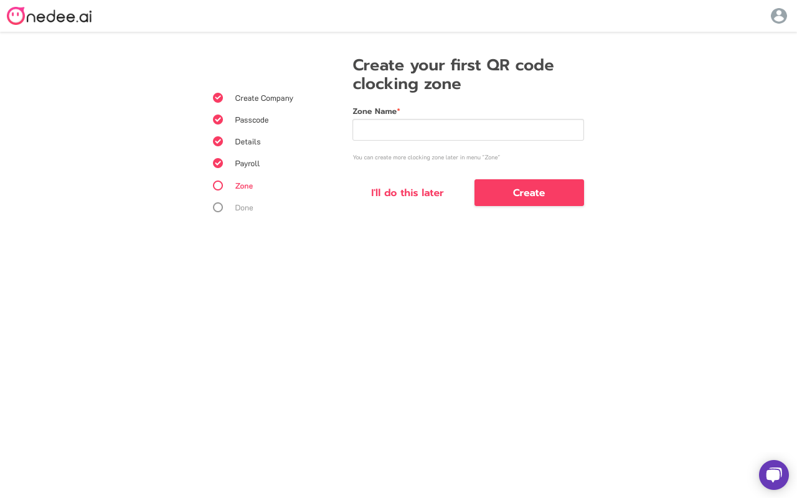
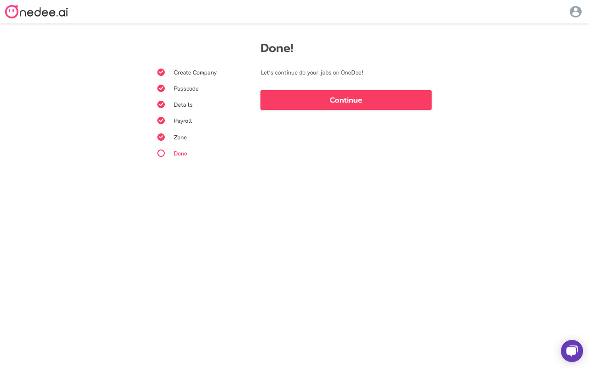

# How to Create new Company

## Set up Profile 

After Login will redirect to **Set up Profile** page

* **Insert image profile**
* Enter **Name and Last name**
* Click **Continue**

* Click **Create New Company**

## How to Create Company 

**Set up your Company**

* **Insert logo company**
* Enter **Company Name, Contact no.**
* Select **Timezone**
* Click **Create New Company**

* **Passcode** will display after created company
* Click **Continue**

**About your Company page**

* Select **Business Type**
* Enter **your business details**
* Enter **Office Address**
* Click **Continue**

**Set up Payroll page**

* Select **Payroll form**
* Click **Continue**

Create your first QR Code clocking zone

* Enter **Name**
* Click **Continue**


**I'll do this later** can create later


**Done!**

* Click  **Continue**

