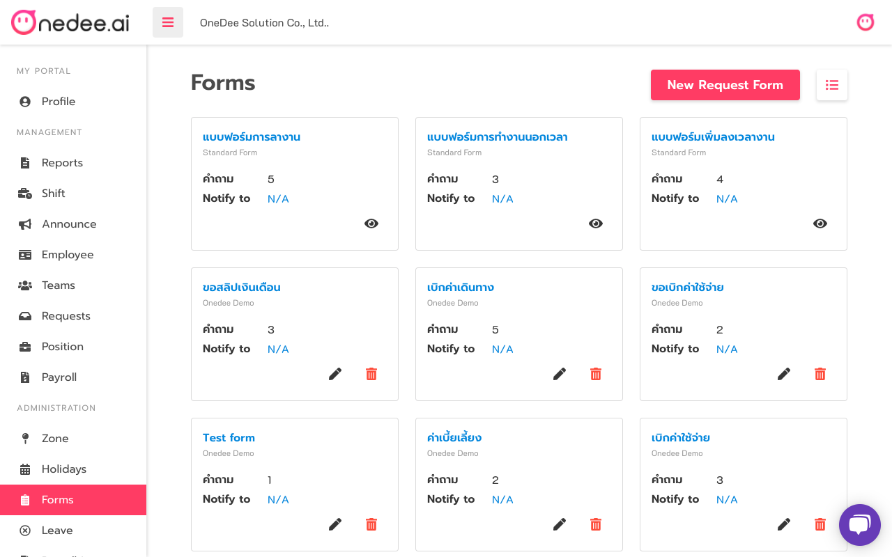
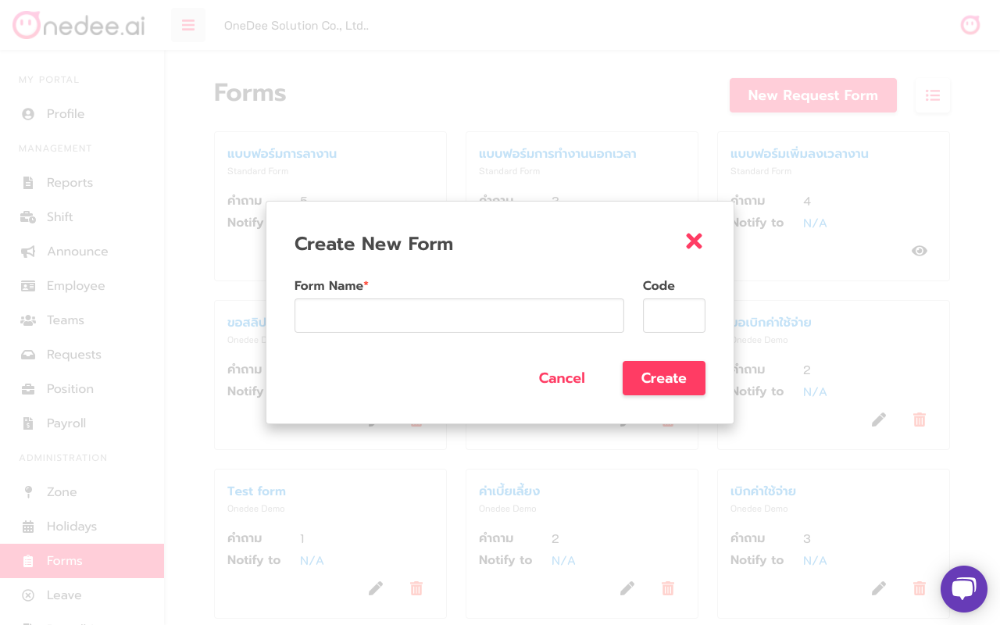
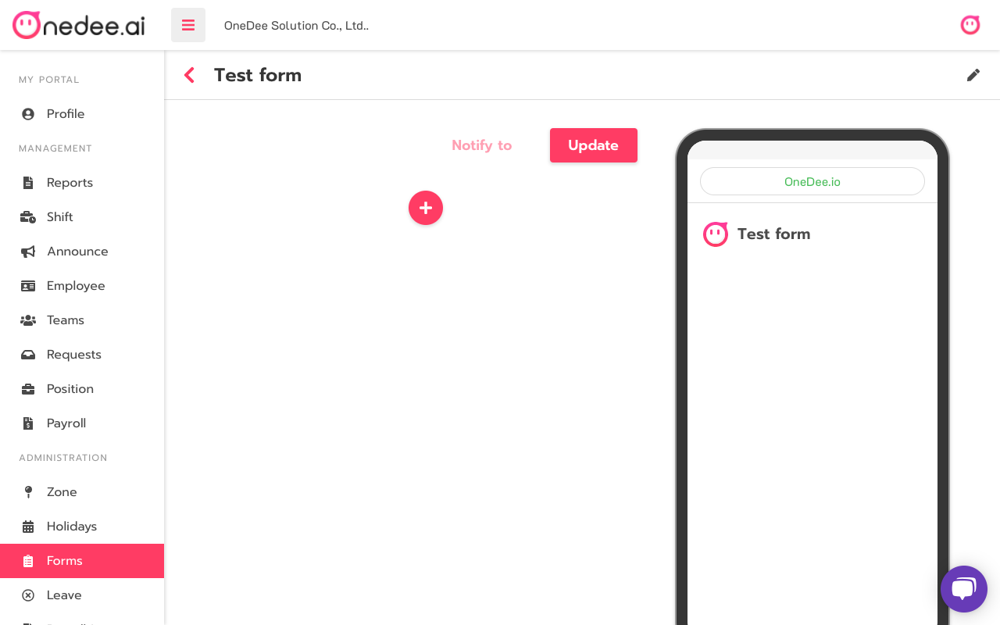
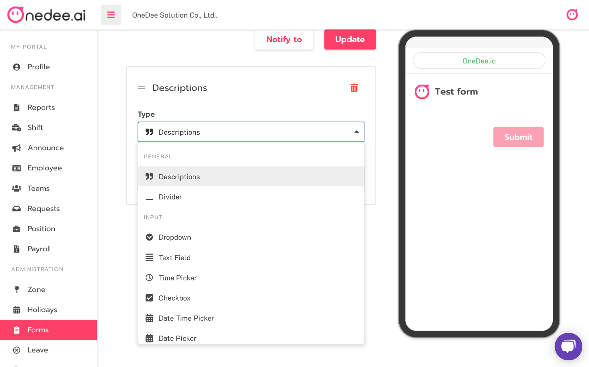

# How to create Form

**OneDee** has 3 standard forms are Leave Request Form, Overtime Request Form and Add Clock Request Form



## How to create Form

* Go to **Forms Menu**
* Click **New Request Form**

* Enter **Form** **Name** 
* Click **Create**

* Click icon  for create type in form

* Select **Type**
  * **Descriptions** 
  * **Divider**
  * **Dropdown**
  * **Text Field**
  * **Time Picker**
  * **Checkbox**
  * **Date Time Picker**
  * **Date Picker**
  * **Image Picker**
  * **File Picker**
  * **Radio**
* Click **Save/Update**

