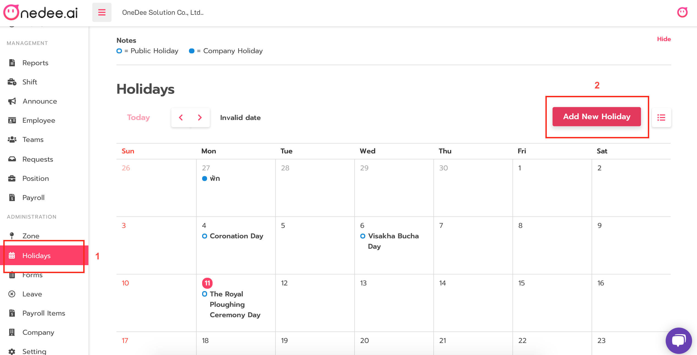
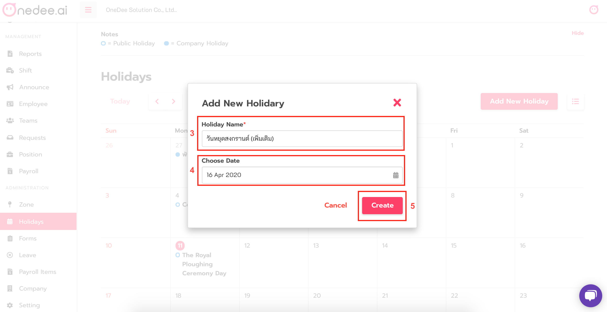
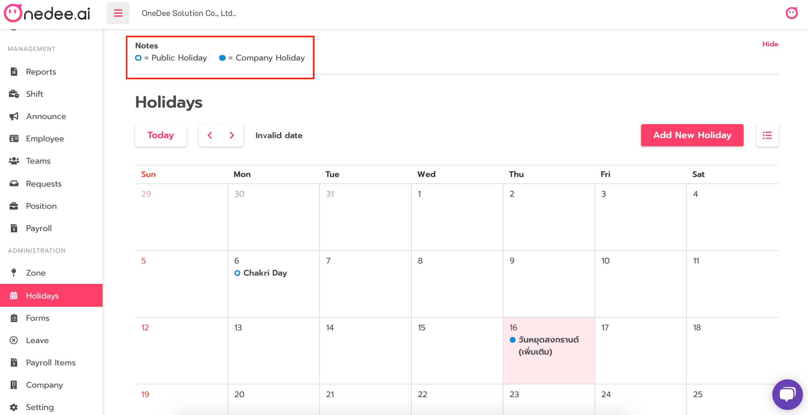

# How to set Holiday

* Go to **Holidays** **Menu**
* Click **Add New Holiday**

* Enter **Holiday Name**
* Select Date on **Choose Date** field
* Click **Create**


* **Public Holiday** = International holidays or holidays under the labor laws
* **Company Holiday** = You can create by your own company holiday


