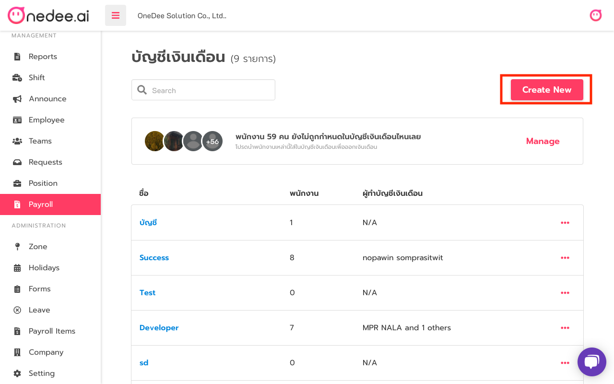
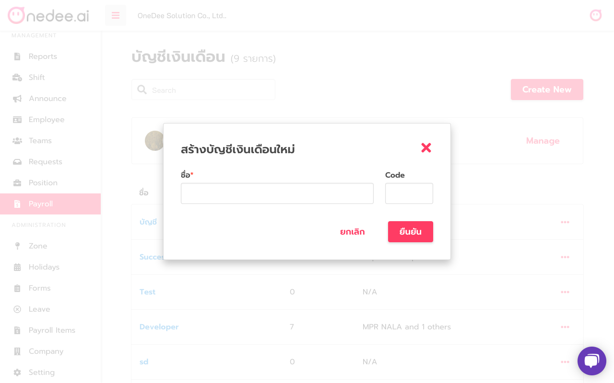
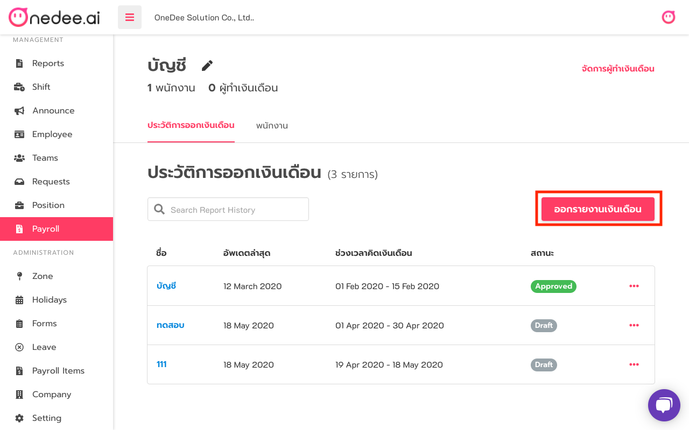
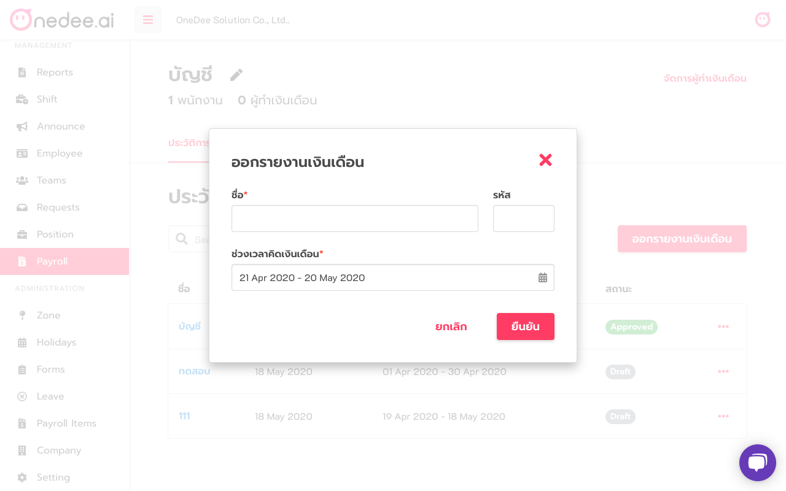
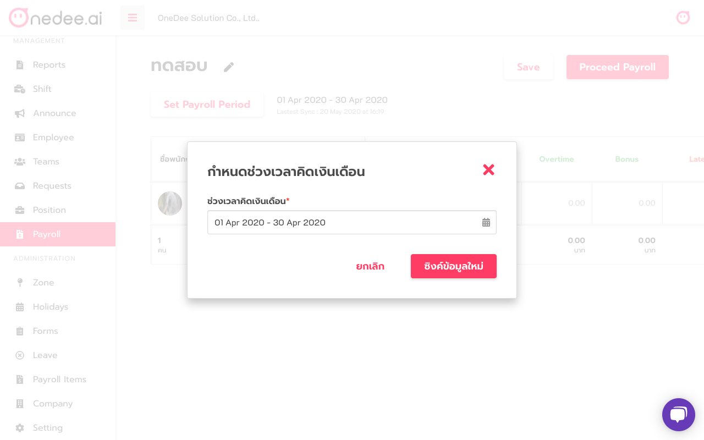
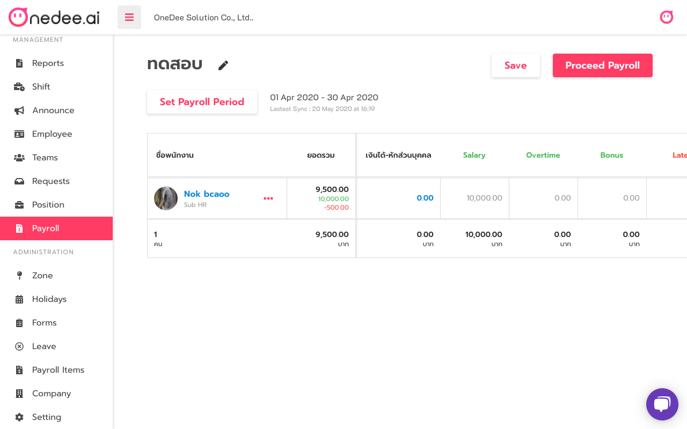
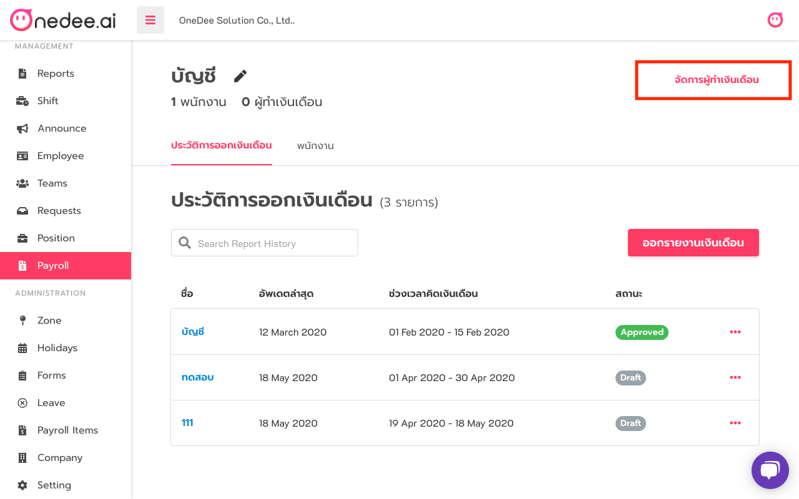
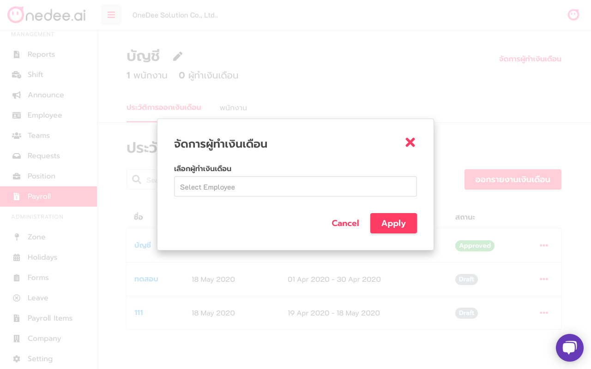
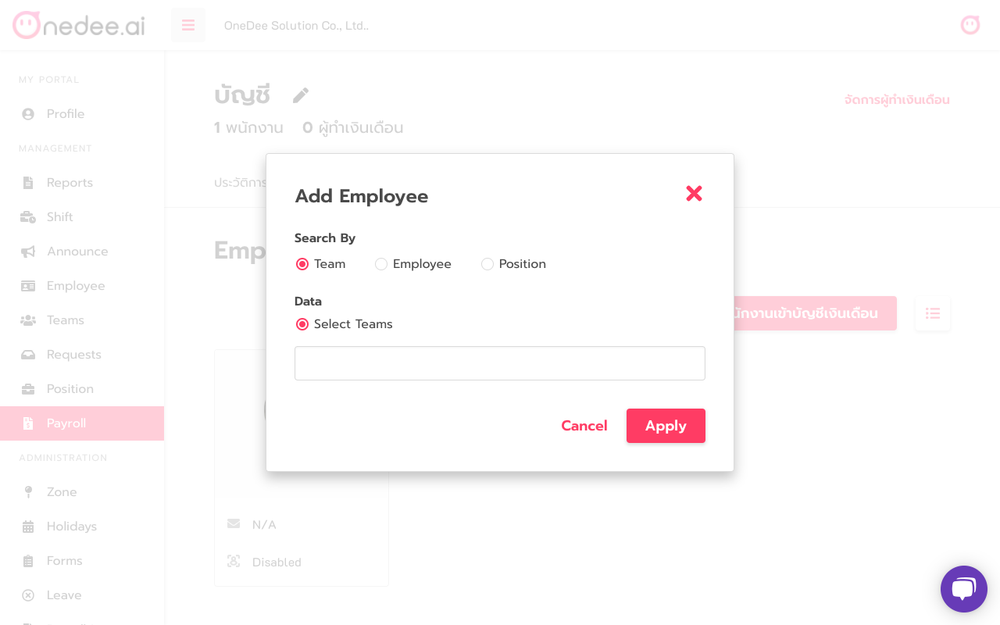

# How to use Payroll


**Payroll Menu** and **Payroll items** can use on Owner or Administrator roles


* Go to **Payroll Menu**
* Click **New Payroll**

* Enter **Payroll Name**
* Enter **Code** \(option\)
* Click **Create**

## How to manage Payroll Report

* Click **Payroll Report**

* Enter **Payroll Name**
* Enter **Code** \(option\)
* Select **Date Range**
* Click **Apply**

* Click **Payroll Period**
* Select **Date Range**
* Click **Sync Data**

* Edit **Details**\(Salary, OT, Tax or Social Security\)
* Click **Save**
* Click **Proceed Payroll** to approve this payroll

## How to add Payroll Maker

* Click **Add Maker**

* Enter **Employee Name**
* Click **Employee Name**
* Click **Apply**

## How to add Employee to Payroll

* Click **Employee** tab
* Click **Add Employee**

* Select **Search by** and **Data**
* Click **Apply**

