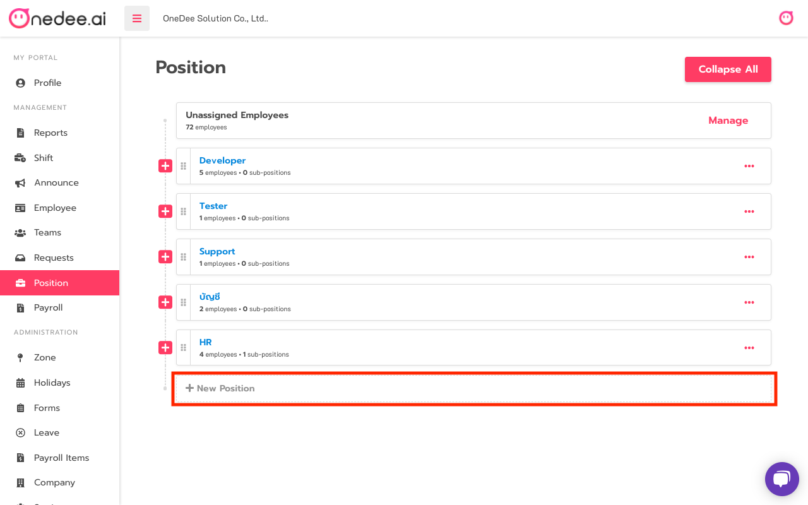
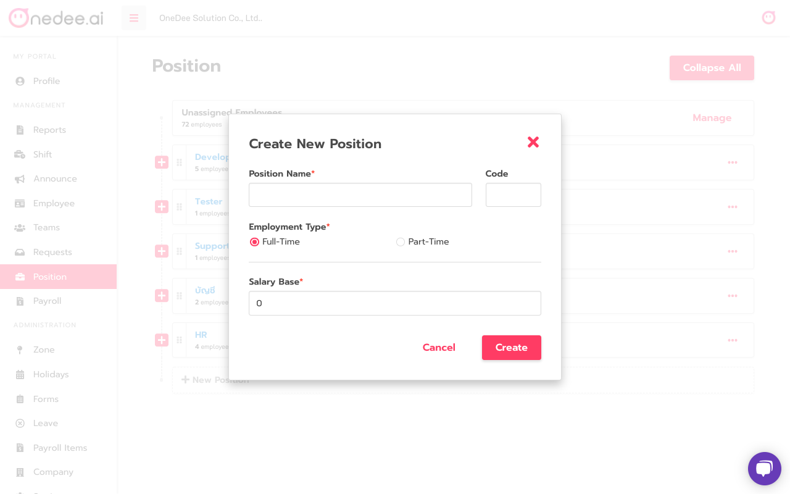
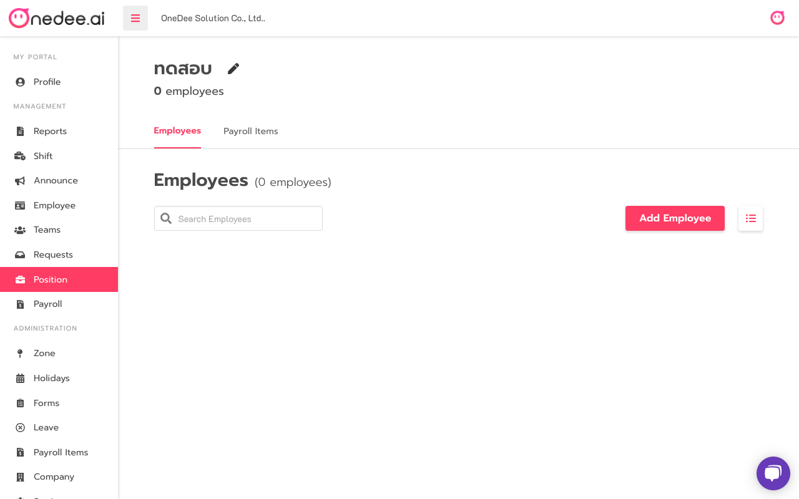
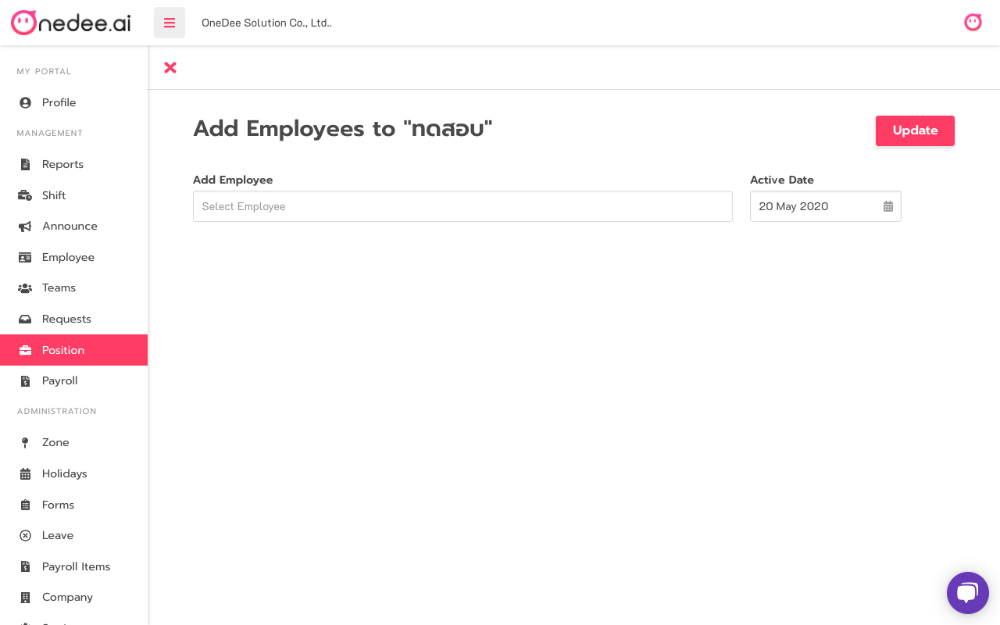
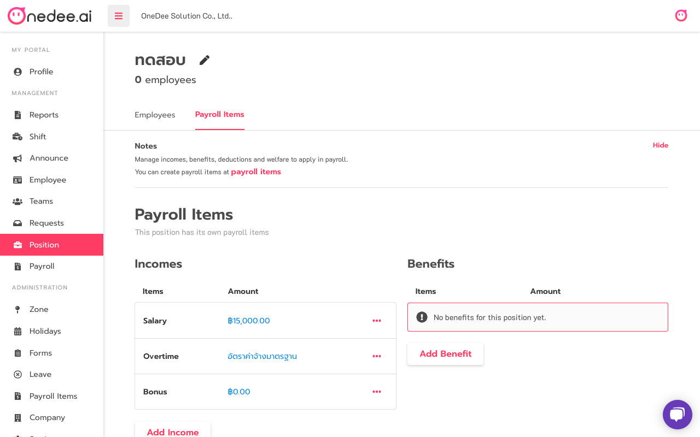
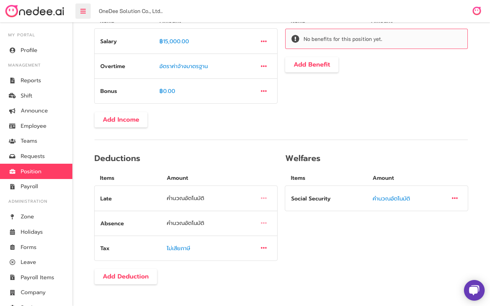

# How to use Position


**Position Manu** can use on Owner and Administrator roles


* Go to **Position Menu**
* Click **New Position**

* Enter **Position Name**
* Select Employment type **Full-Time** or **Part-Time**
* Set **Salary Base**
* Click **Create**

## How to Add Employee to Position

* Click **Add Employee**

* Click on **Select Employee**
* Select **Employee Name**
* Set **Active Date**
* Click **Update**

## How to set Payroll items

* Set **Base Salary**
* Set **Incomes, Benefit, Deductions** and **Welfare**

