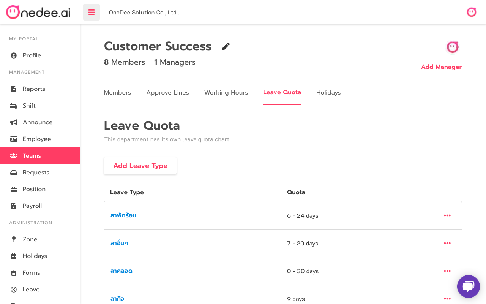
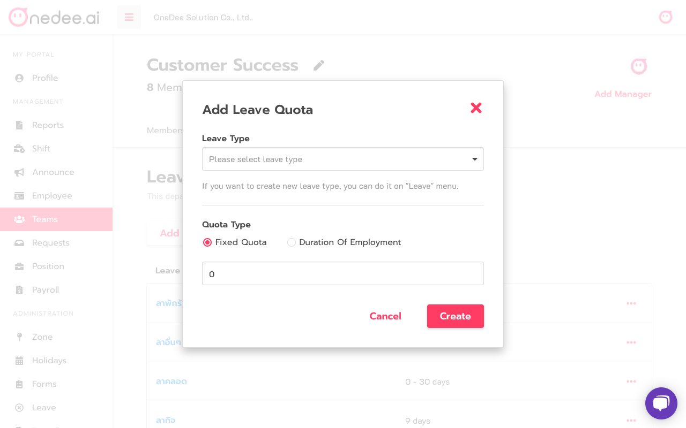
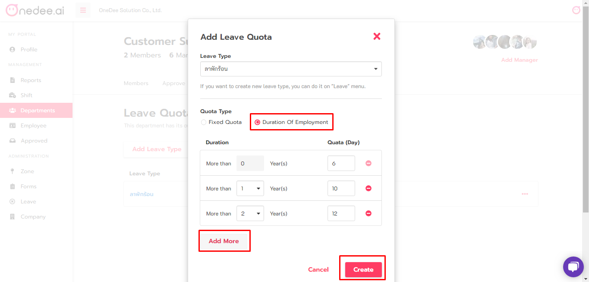

# How to create Leave Quota

* Go to **Teams Menu**
* Select **Team** you want

* Click tab **Leave Quota**
* Click **Add Leave Type** to add leave quota

* Select **Leave Type**
* Set **Quota Type \(Fixed Quota** or **Duration of Employment\)**
* Set **Number of Quota**
* Click **Create**

## How to set Leave Quota for Duration Of Employment

* Select **Duration Of Employment**
* Click **Add More**
* Click **Create**

