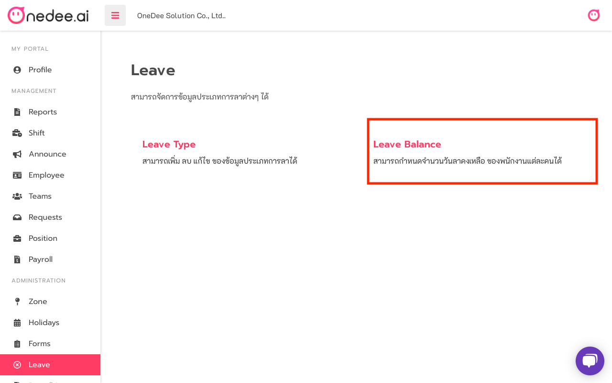
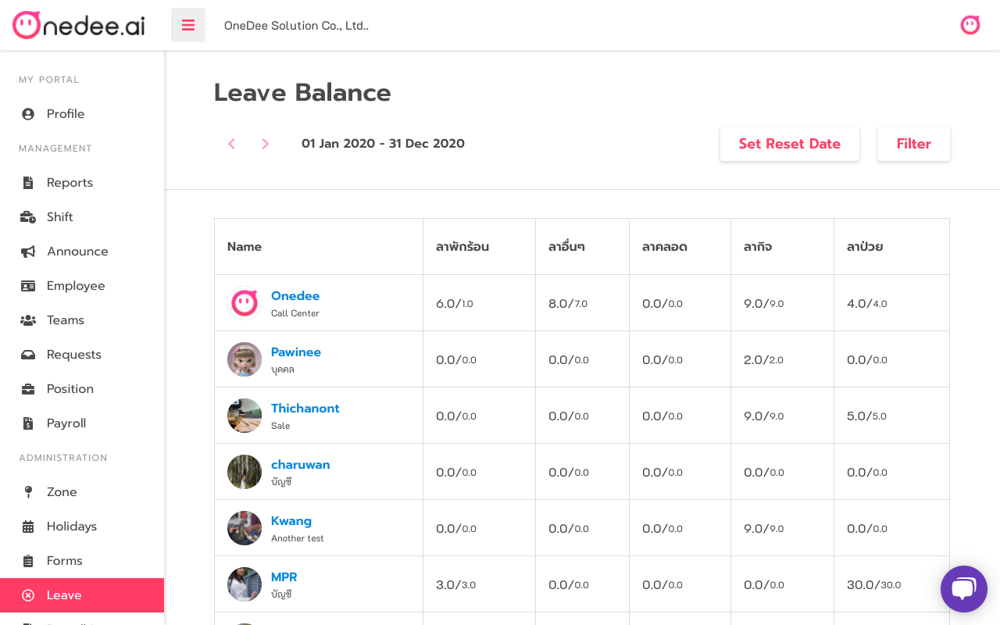
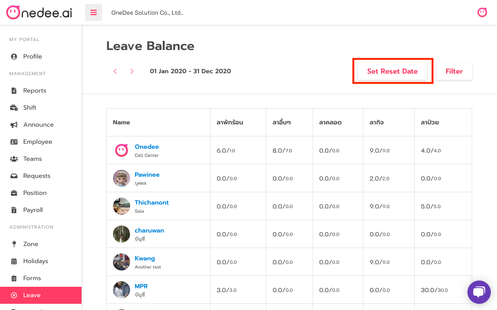
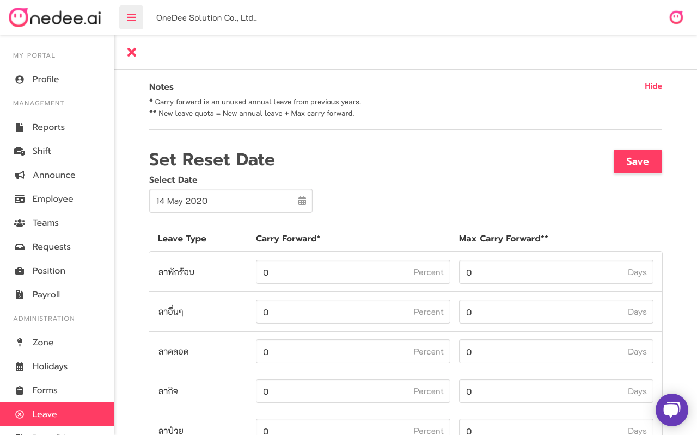

# Leave Balance

## How to use Leave Balance

* Go to **Leave Menu**
* Click **Leave Balance**

* Display Employee and Leave Quota after set on Teams Menu &gt; Leave Quota

## How to reset Leave

* Click **Set Reset Date**

* Select **Date**
* Set **Carry Forward\(%\)**
* Set **Max Carry Forward\(Days\)**
* Click **Save**

