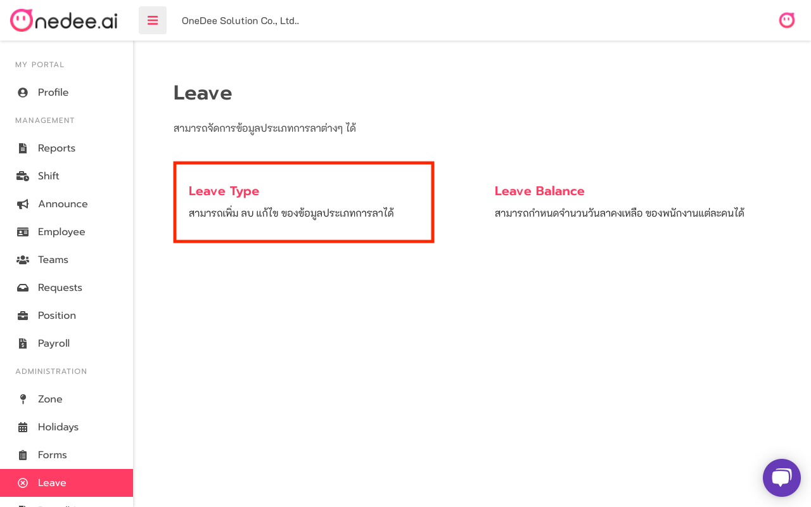
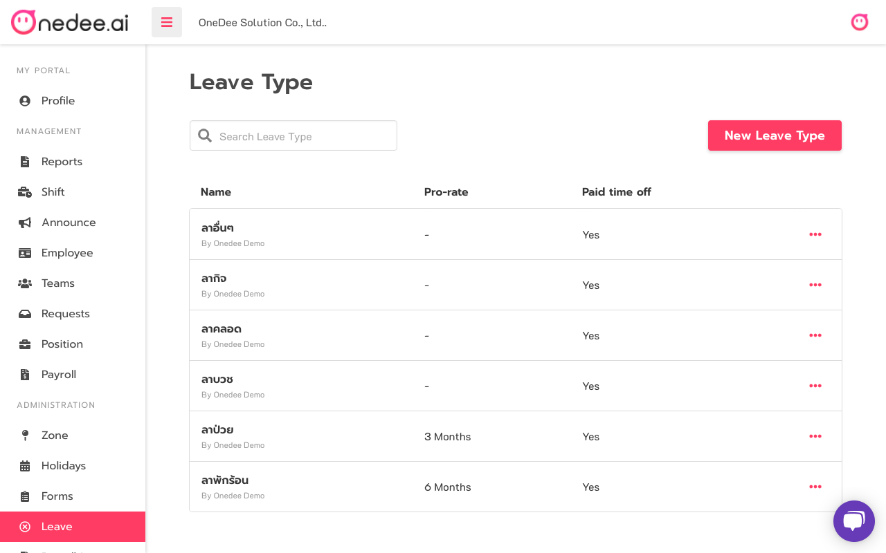
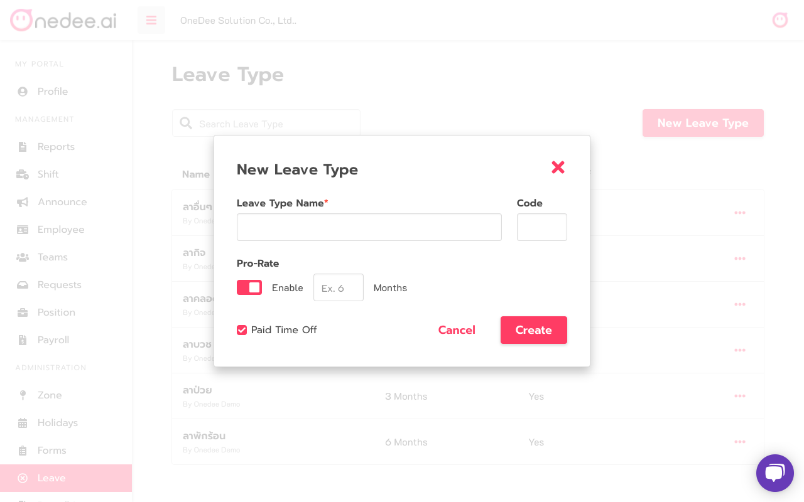

# Leave type

## How to create Leave type

* Go to **Leave Menu**
* Click **Leave Type**

* Click **New Leave Type**

* Enter **Leave Type Name**
* Enter **Code\(option\)**
* Set [**Pro-Rate**](https://support.onedee.ai/th/faq/question/general#pro-rate) \(option/Pro-Rate policy in each company\)
* Select **\*\*\[**Paid Time Off**\]\(**[https://support.onedee.ai/th/faq/question/general\#paid-time-off](https://support.onedee.ai/th/faq/question/general#paid-time-off)**\) \*\*For have to pay when employee leave**
* Click **Create**

