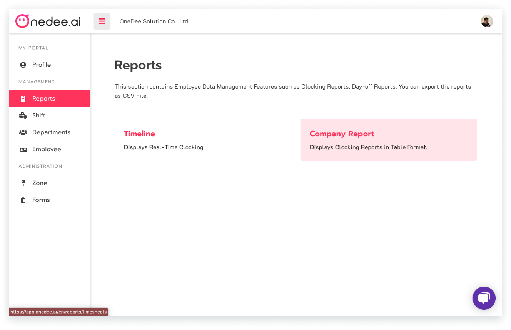
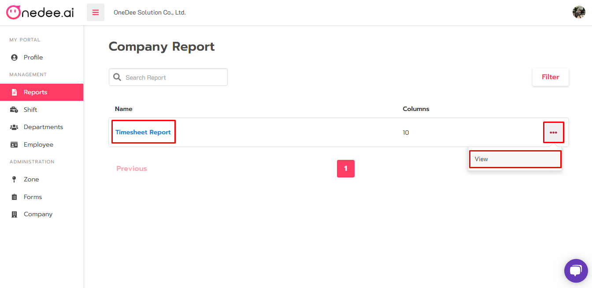
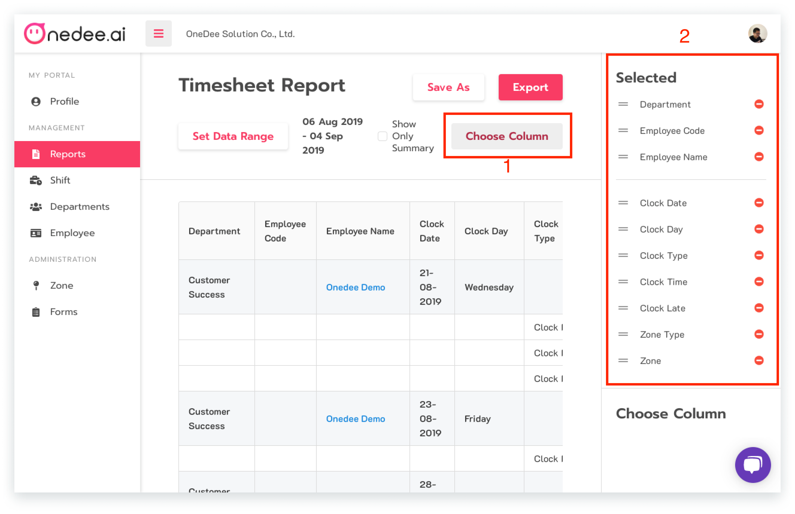
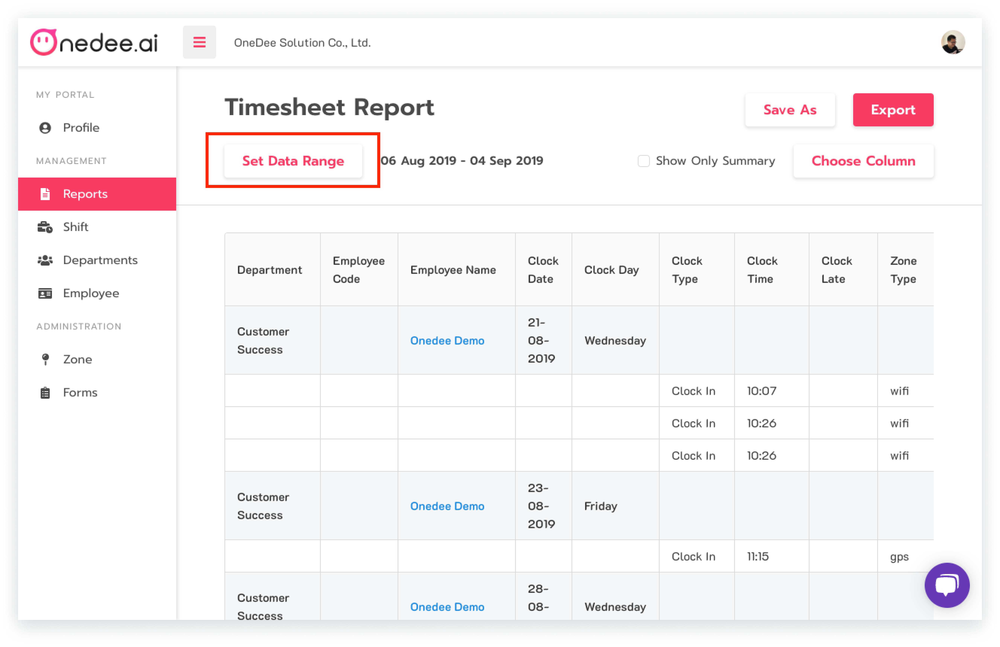
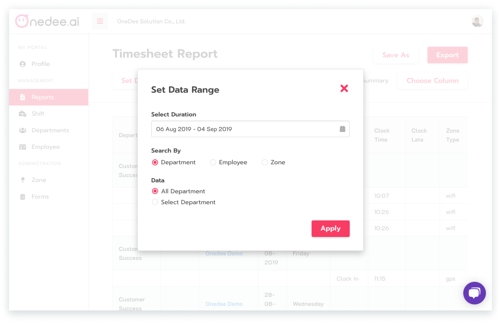
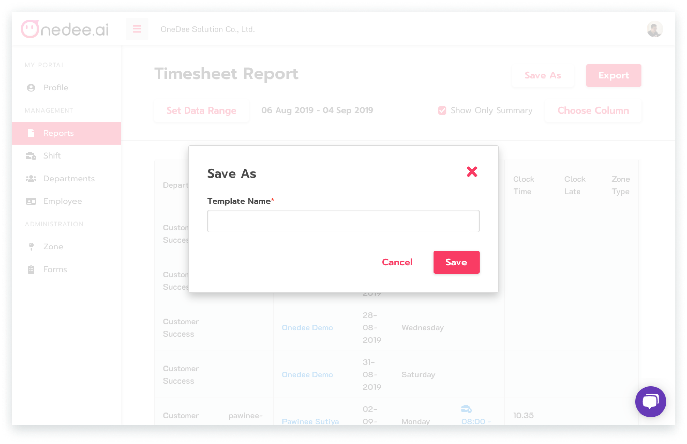
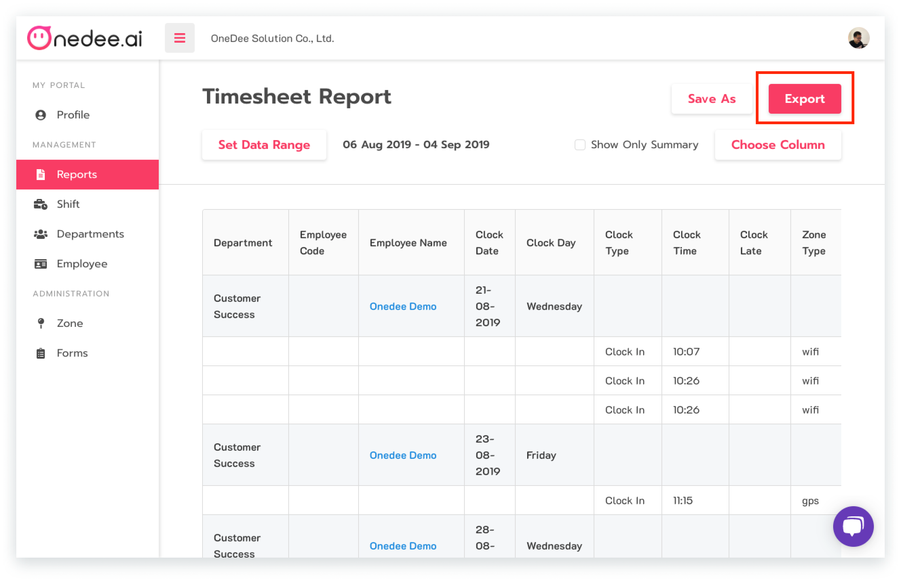

# Timesheet Report



## How to user Timesheet Report

* Go to **Reports Menu**
* Click **Timesheet Report**

* Click icon **"..."** and click **View** or click **Template Name**
* Click **Choose Column**
* Click icon  for hide **Column** or click icon  for show **Column** 

## How to Search on Timesheet

* Click **Set Data Range**

* Select **Daterange**
* Select **Search** with employee, **Zone**, **Team**
* Select **Data** for **All Team** or **Select Team**
* Click **Apply**

## How to Save own template

* Click **Save As**

* Enter **Report name**
* Click **Save**

## How to Export report


You can **Export** file CSV. Excel and Text file


* Click **Export**

