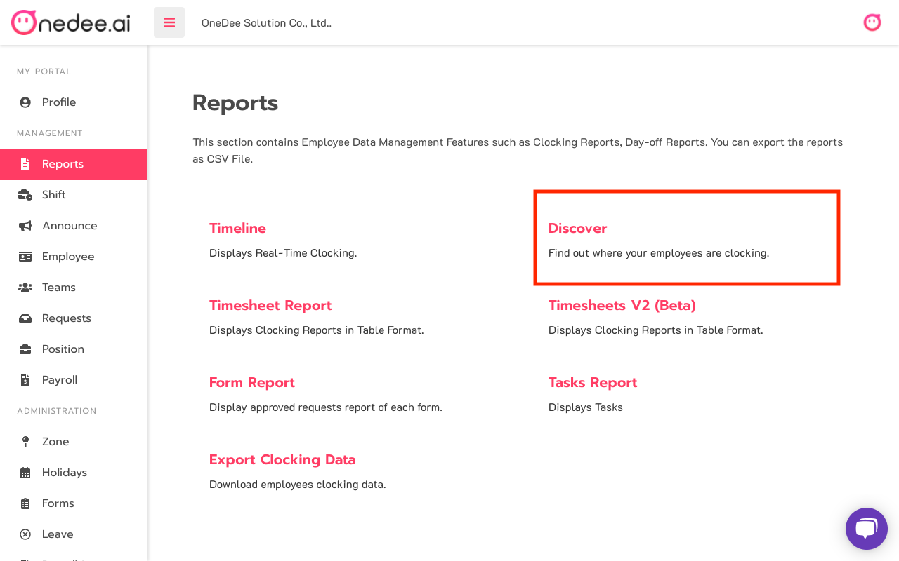
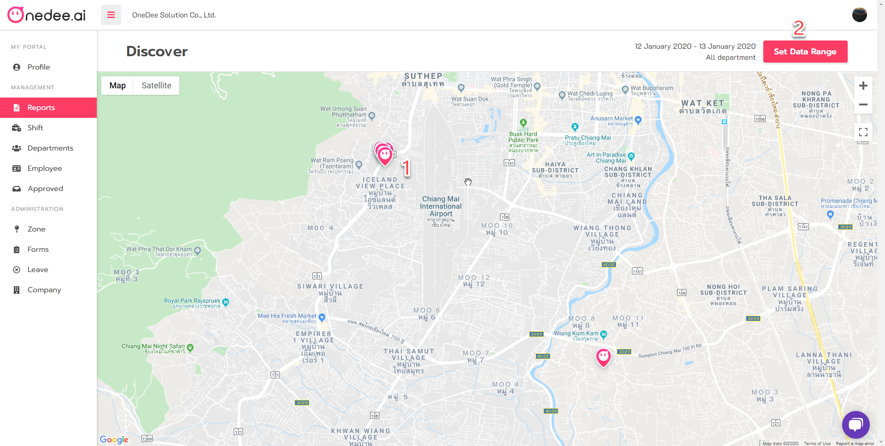
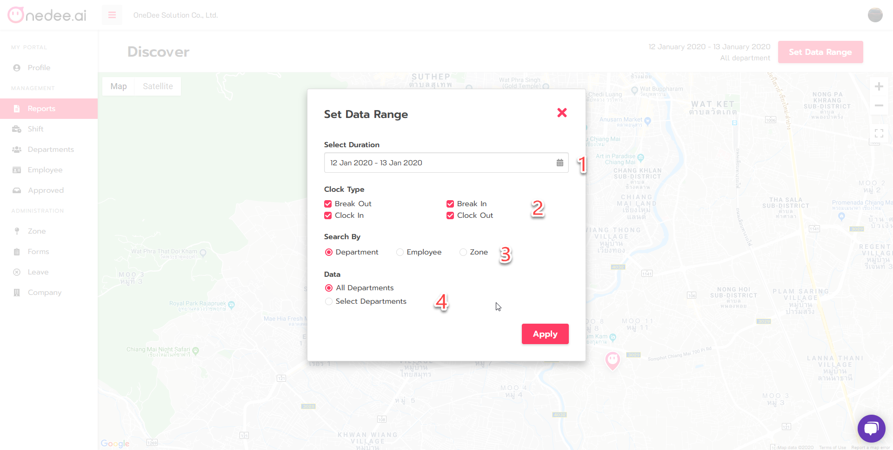

# Discover

## How to use Discover Report

* Click **Reports Menu**
* Click **Discover**

* Click **Set Dara range**

This report will display clock data as a pin on the map  
1. You can click on the pin on the map for view that clock details  
2. Click **Set Data Range** for filter clock data on the map

**Set Data Range**

* Select **Duration**
* Select **Clock Type**
* Select **Search by**
* Select **Data for All Team or Select Team**

