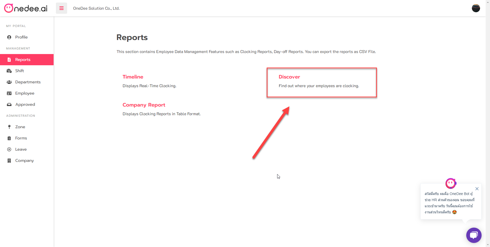

# Discover

คลิกเมนู **"Reports"** เพื่อเรียกดูประเภทของรายงาน

คลิกเมนู **"Discover"** เพื่อดูรายงานจุดลงเวลาในรูปแบบของแผนที่

ระบบจะแสดงจุดลงเวลาของพนักงานตามสถานที่ต่างๆในสัญลักษณ์ หมุดวันดี  
1. สามารถคลิกที่หมุดเพื่อทำการดูรายละเอียดเพิ่มเติมของจุดลงเวลานั้นๆ  
2. คลิกปุ่ม **"Set Data Range"** เพื่อทำการกรองข้อมูลต่างๆ สำหรับแสดงในแผนที่

**Set Data Range**  
1.เลือกช่วงเวลาที่ต้องการดูจุดลงเวลา  
2.เลือกประเภทของการลงเวลาหรือพักเบรก  
3.เลือกรูปแบบประเภทการค้นหา เช่น Department, Employee และ Zone  
4.เลือกกลุ่มในการดูรายงานโดยแบบทั้งหมดหรือโดยเฉพาะเจาะจง

