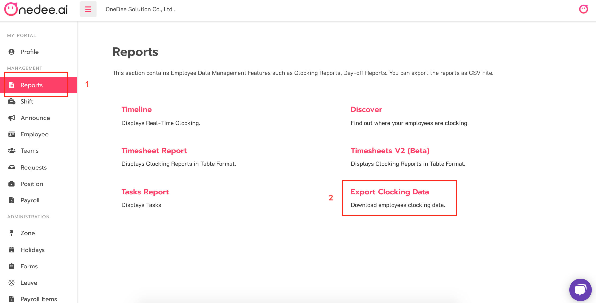
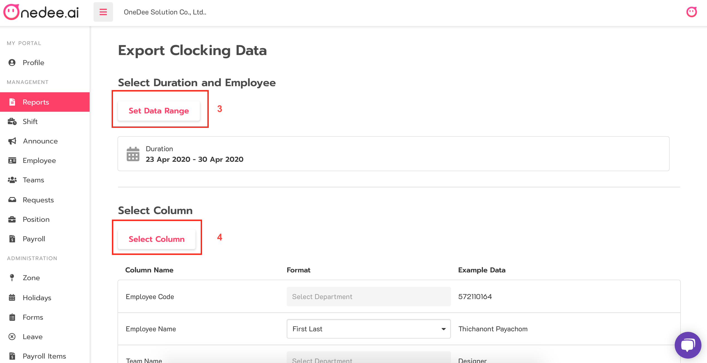
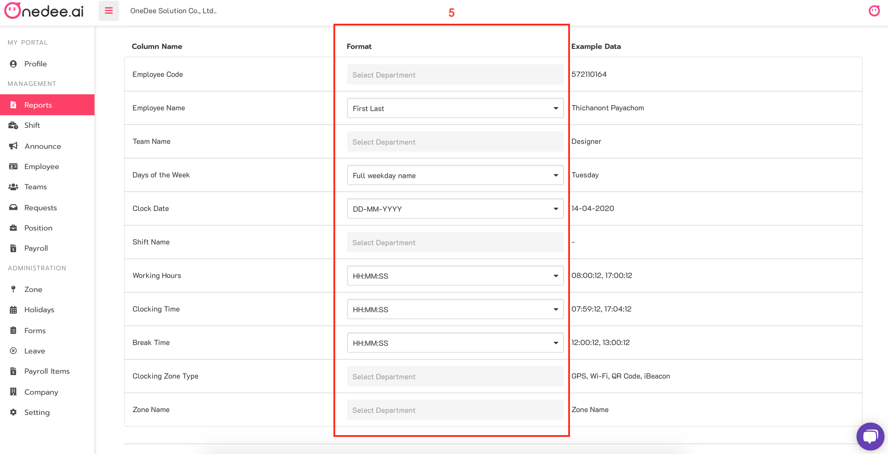
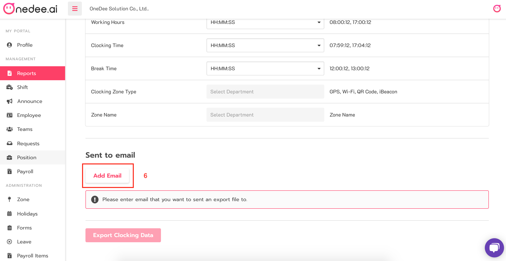
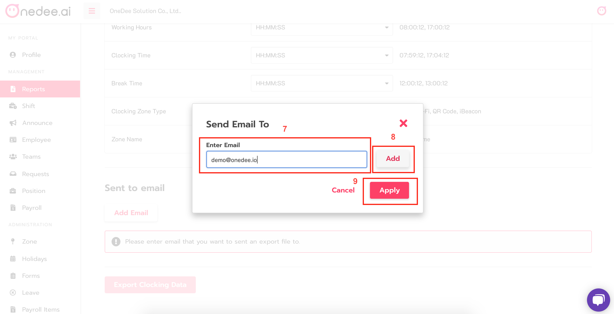
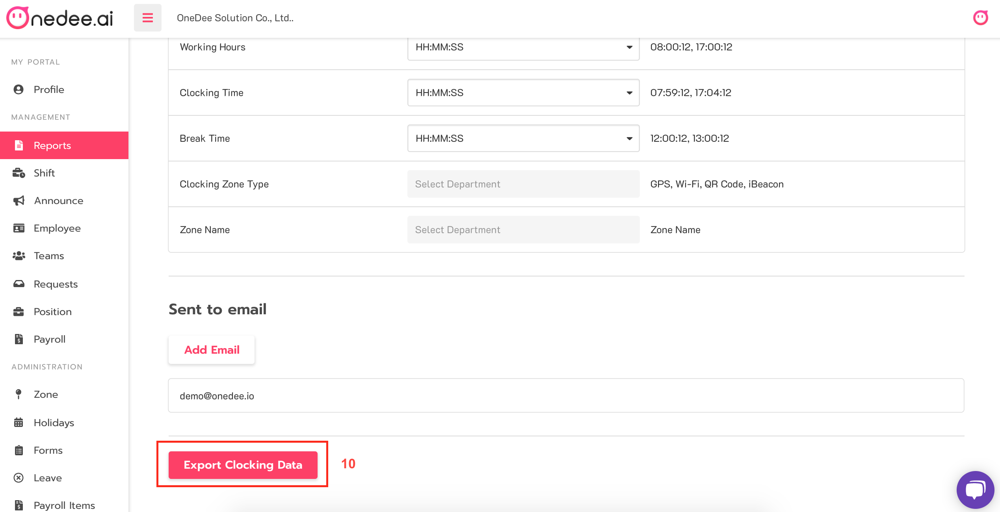
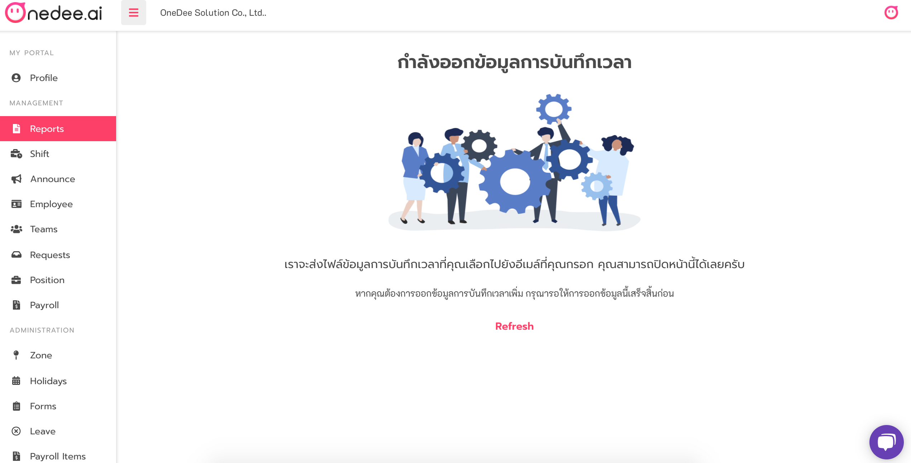

# Export Clocking Data

## How to Export Clock data

* Go to **Reports Menu**
* Click **Export Clocking Data**

* Click **Set Date Range** for select duration
* Click **Select Column** you want

* **Set Format in each Column**

* Click **Add Email**

* Enter **Email** you want
* Click **Add**
* Click **Apply**

* Click **Export Clocking Data**

* Waiting for send clocking data report to your email


You can Download Clocking data report on your Email


