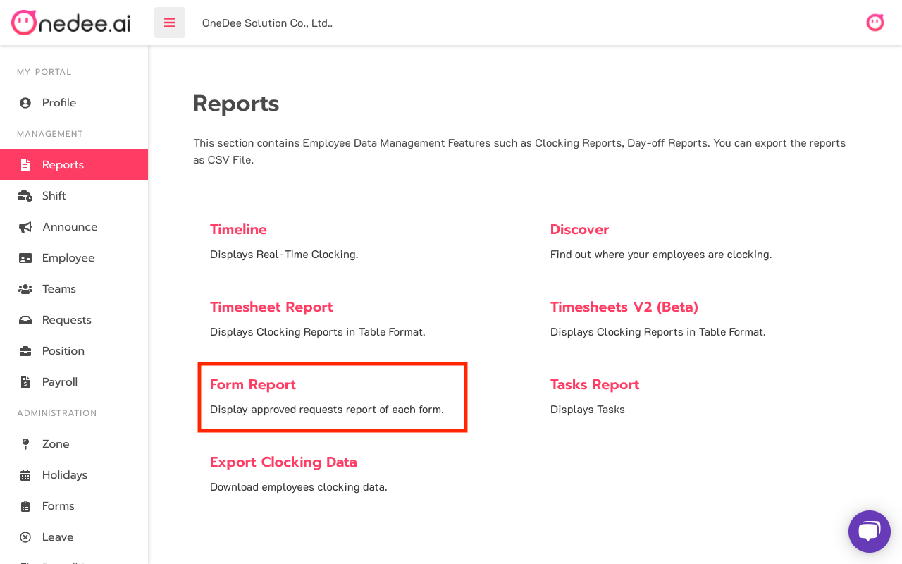
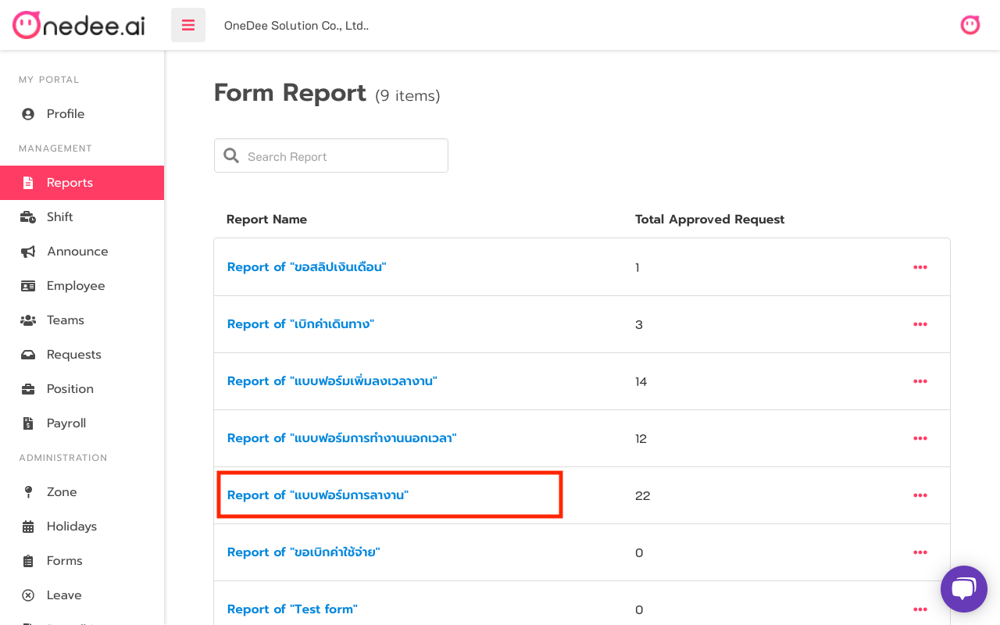
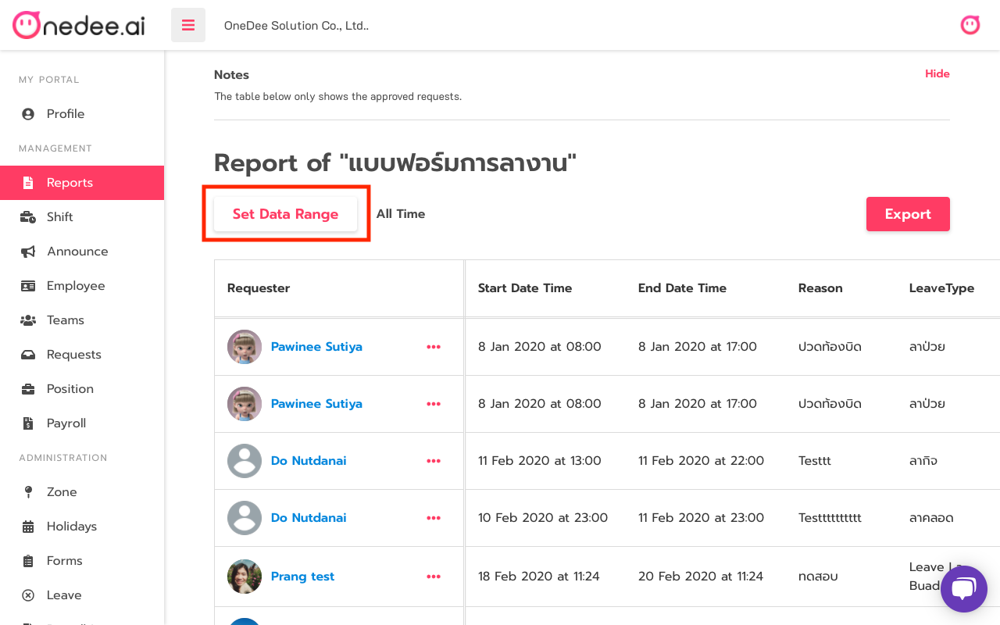
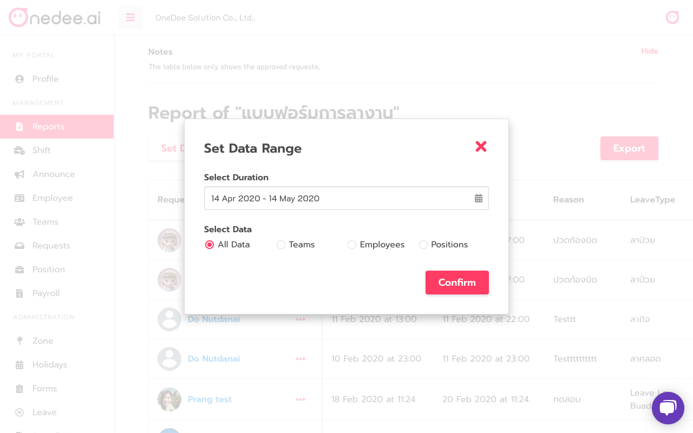
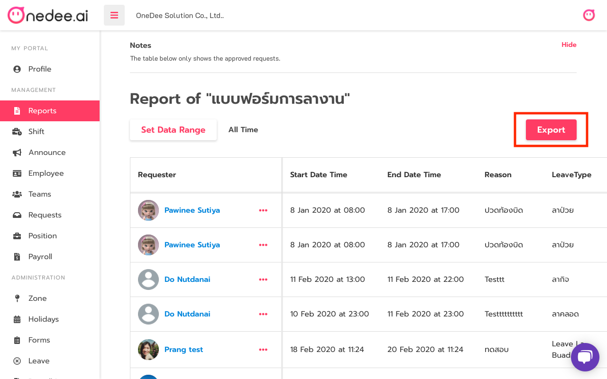
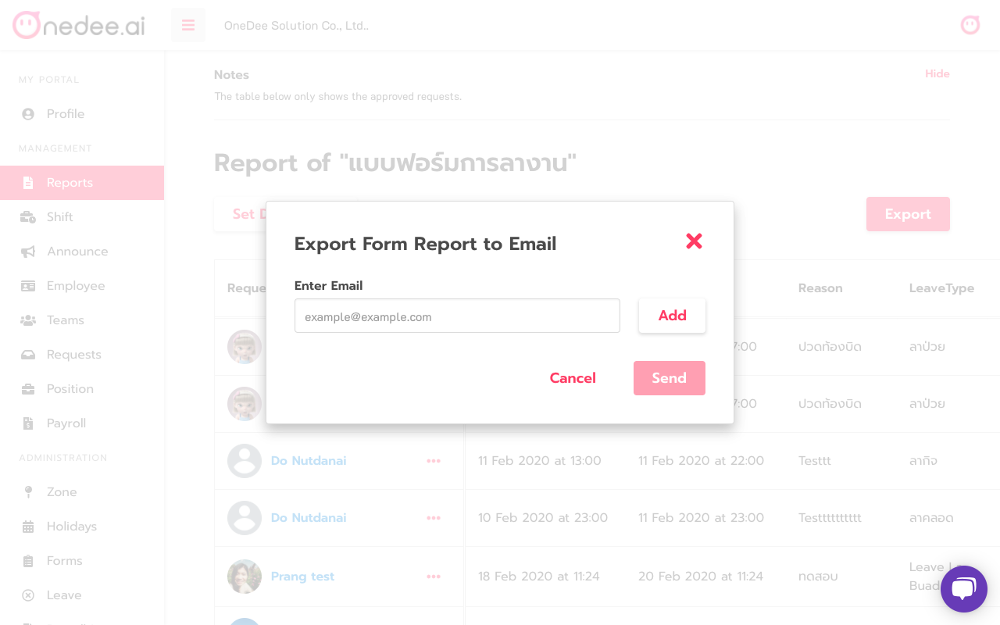

# Form Report

## How to use Form Report

* Go to **Reports Menu**
* Click **Form Report**

* Click **Form Name**

* Click **Set Data Range**

* Select **Duration**
* Select **Data \(All Data, Teams, Employees or Positions\)**
* Click **Confirm**

## How to Export Form Report

* Click **Export**

* Enter **Email** you want
* Click **Add**
* Click **Send**

