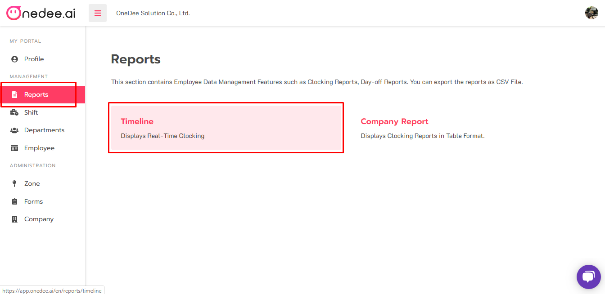
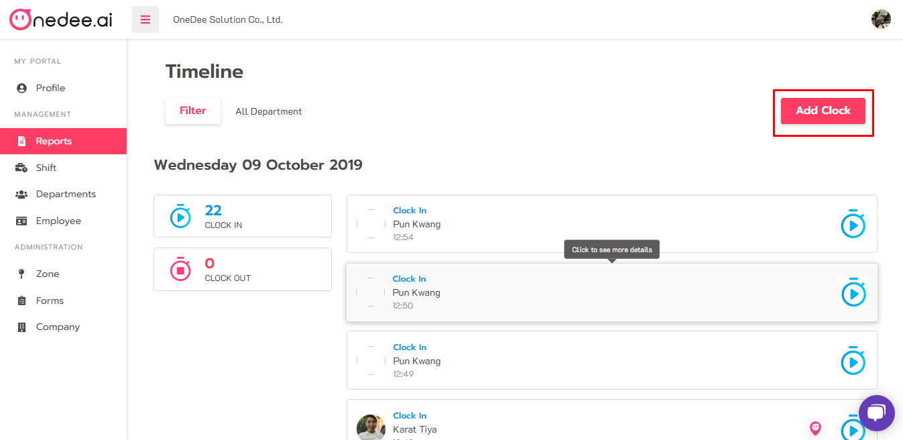
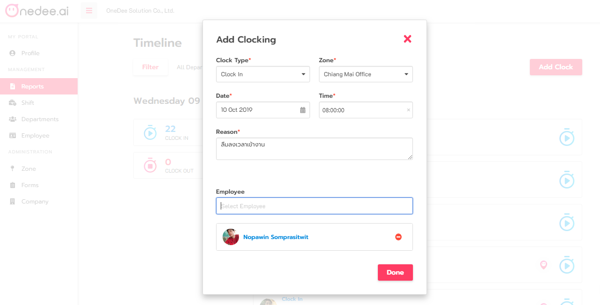

# How to Add Clock

## Step to Add Clock

* Go to **Reports Menu**
* Click **Timeline**

* Click **Add Clock**

* Select **Clock Type**
* Select **Zone**
* Select **Date** 
* Select **Time** 
* Enter **Reason** 
* Select **Employee** 
* Click **Done** 

