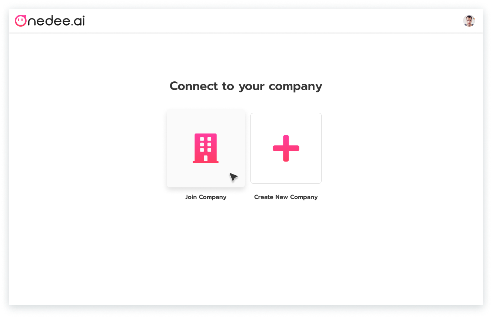
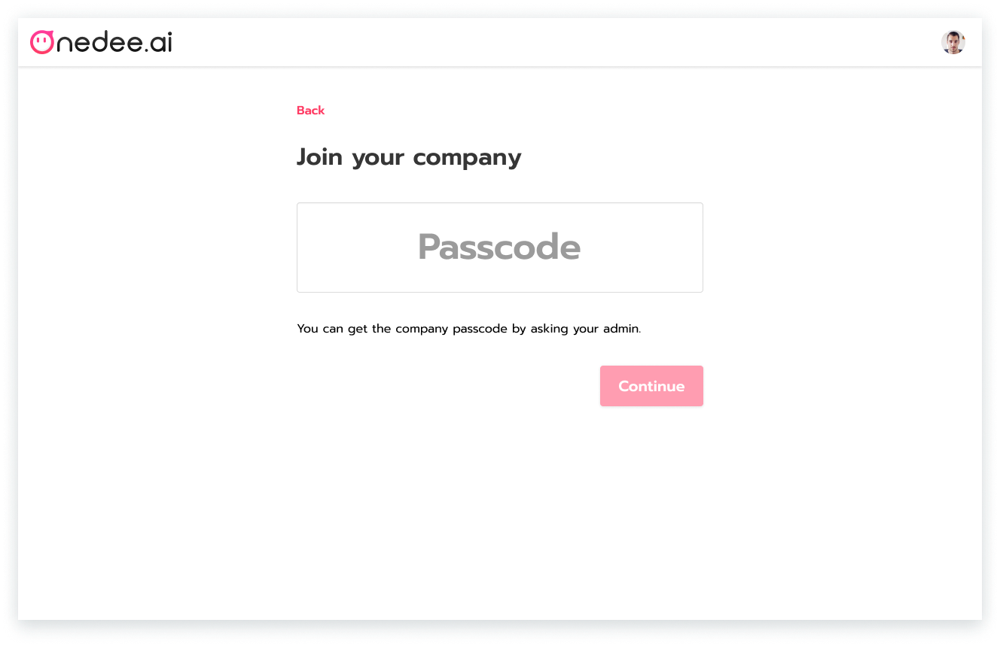
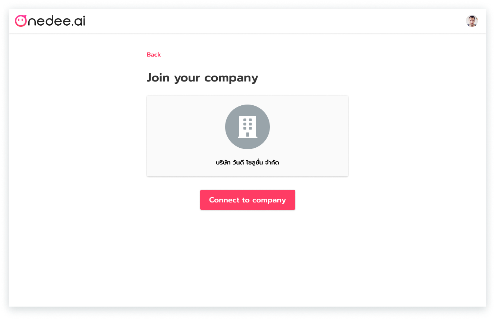
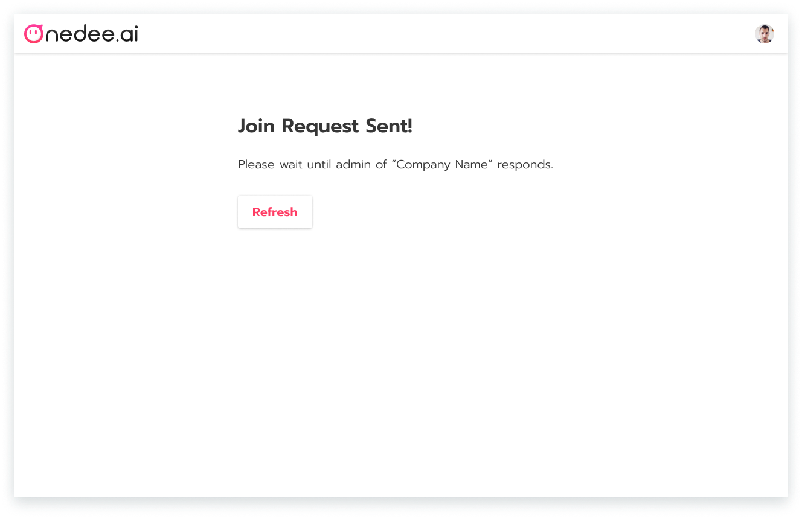

# How to Join Company

## Set up Profile 

After Login will redirect to **Set up Profile** page

* **Insert image profile**
* Enter **Name and Last name**
* Click **Continue**

## How to Join Company

* Click **Join Company**

* Enter **Passcode**
* Click **Continue**

* Click **Connect to Company** for join company

**Join Request sent!**


After join request sent you can tell Admin approve your request 


