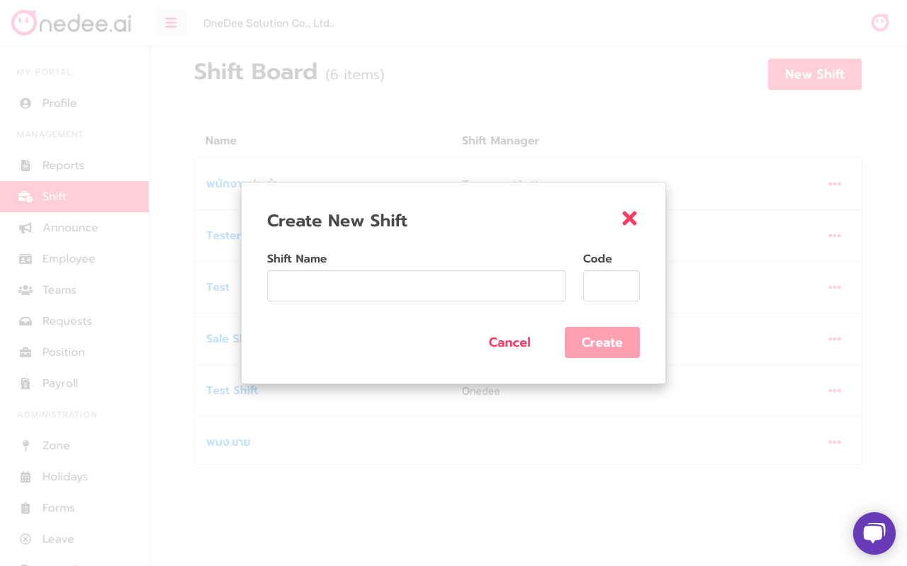
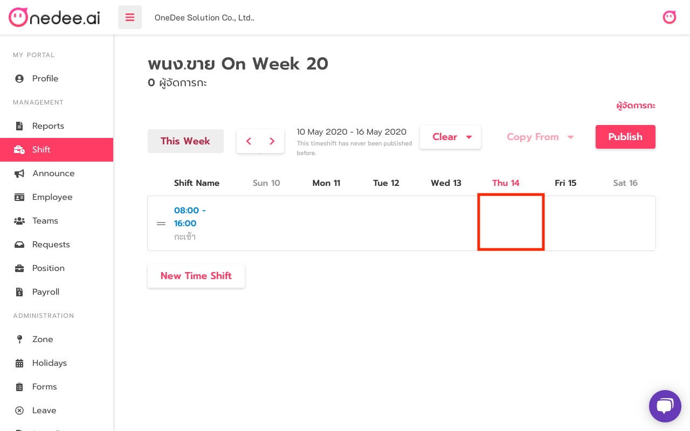

# How manage Shift



## How to create Shift Board

* Go to **Shift Manu**
* Click **New Shift**

* Enter **Shift Name** you want
* Enter **Code** \(option\)
* Click **Create**

## How to create Time Shift

* Click **Shift Name** you want

* Click **New Time Shift**

* Enter **Time Shift Name** you want
* Select **Start Shift**
* Select **End Shift**
* Set **Break Duration**
* Set **Late After**
* Set **Absence After**
* Click **Create**

## How to Add Employee into Time Shift

* Click **the Box** in the shift 

* Search **Employee by name**
* Click **Employee** you want
* Set **Pay Rate**
* Click **Save**

## How to Public/Update Time Shift

* Click **Public/Update** after set all data in that shift

## How to Add Shift Maker

* Click **Add Shift Maker\(ผู้จัดการกะ\)**
* Search **Employee by name**
* Click **Employee** you want
* Click **Apply**

