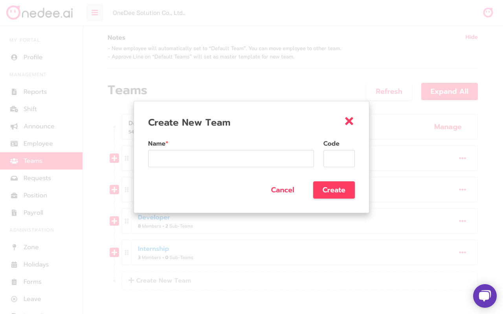

# How to manage Teams

## How to Create Team

* Click **Create New Team** for create **New** **Team**

* Enter **Team Name** you want
* Click **Create**

## How to Create Sub-Team

* Click  for Expand all **Sub-Team**
* Click **Create New Team**

* Enter **Name Sub-Team**
* Click **Create**

## How to add Member

* Enter **Employee Name** in search box 

* Click **Employee Name**

## How to Create Approve Flow

* Click **Approve Line**
* Click **New Flow**

* Enter **Flow Name**
* Click **Create**

## How to Set up Approve Lines

* Click **Set up form...**

## **How to Create and Set up Approval Level** 


* **Manage Approvers** = Set Approval
* **Min. Approval Required** = Number of Approval
* Approve level sort from **bottom** to **top**


* Click  to create or set approval for this **Approve Line** 
* Enter **Approver Group Name**
* Click **Create**

* Click **Manage Approver** 
* Select **ผู้อนุมัติ**
* Click **Save**

* Click **Min. Approval Required** to set number of approval for this line 

## How to set Team Maker

* Click **Add Manager**

* Enter **Employee Name** you want
* Click **Employee Name**
* Click **Save**

