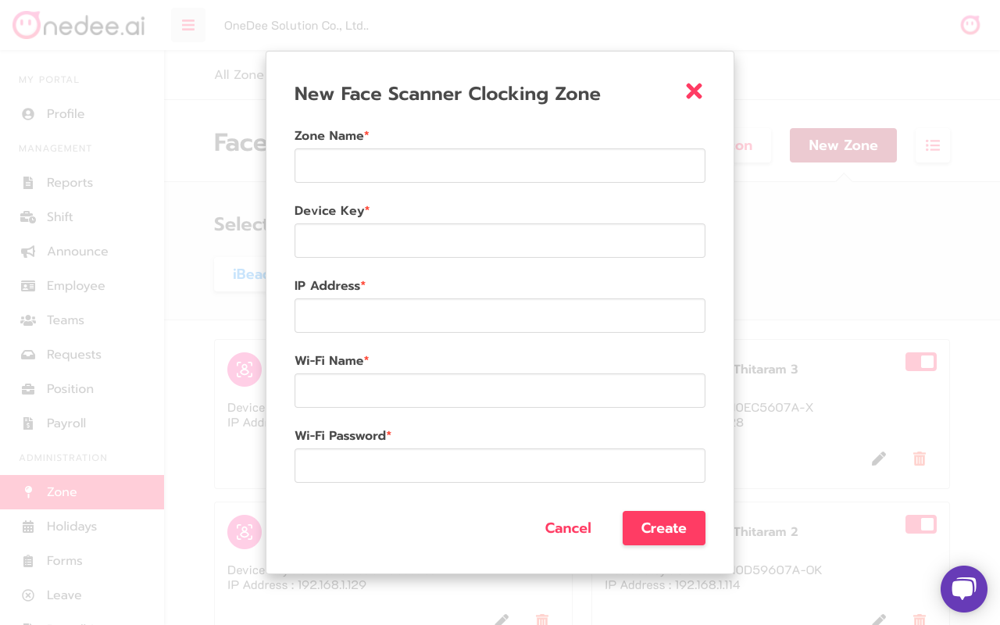

# Face Scanner

## How to create Face Scanner

* Go to **Zone Menu**
* Click **Face Scanner**

* Click **New Zone**
* Click **Face Scanner**

* Enter **Zone Name**
* Enter **Device Key**
* Enter **IP Address**
* Enter **Wi-Fi Name**
* Enter **Wi-Fi Password**
* Click **Create**

