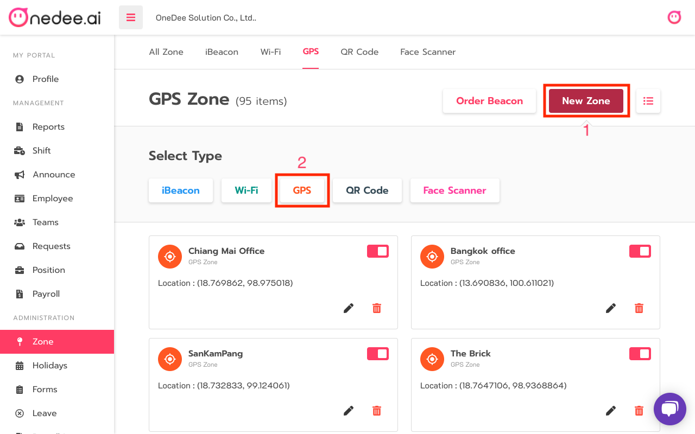
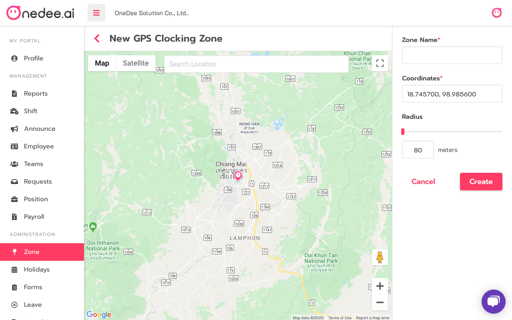

# GPS



## How to Create GPS

* Go to **Zone**
* Click **GPS**

* Click **New Zone**
* Click **GPS**

* Enter **Name** you want
* Enter **Latitude** and **Longitude** or enter name on **Search input**
* Click **Create**


You can set radius between 80 meters to10000 meters.


