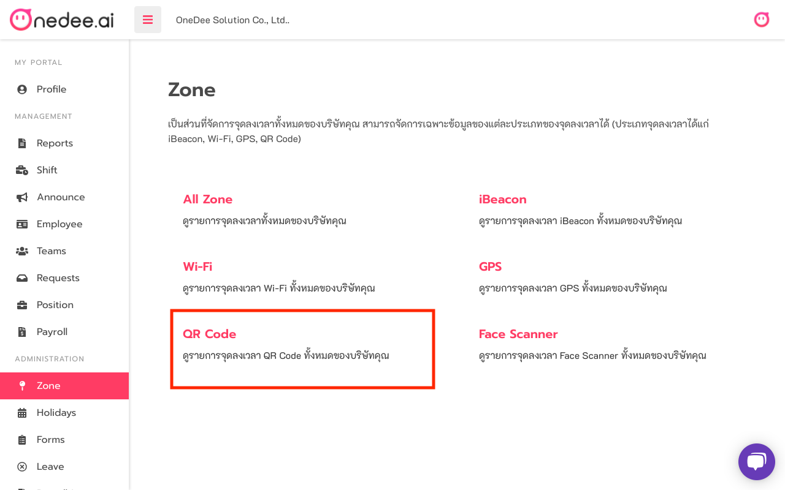
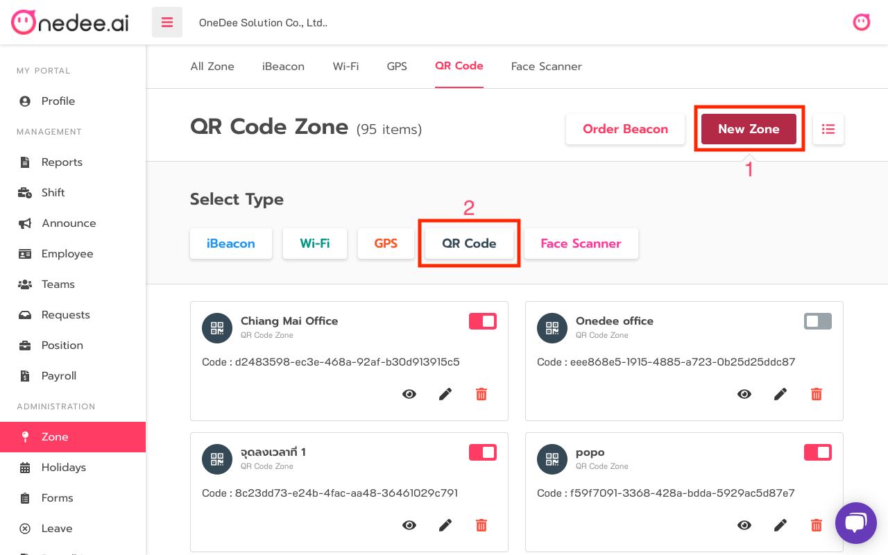
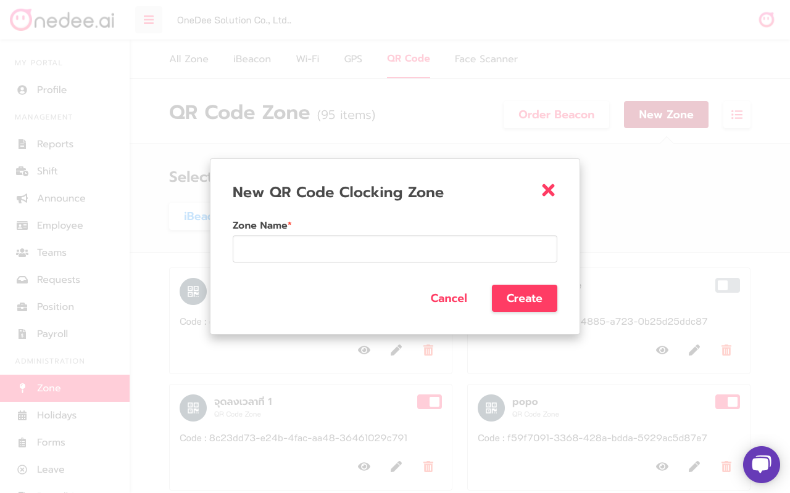
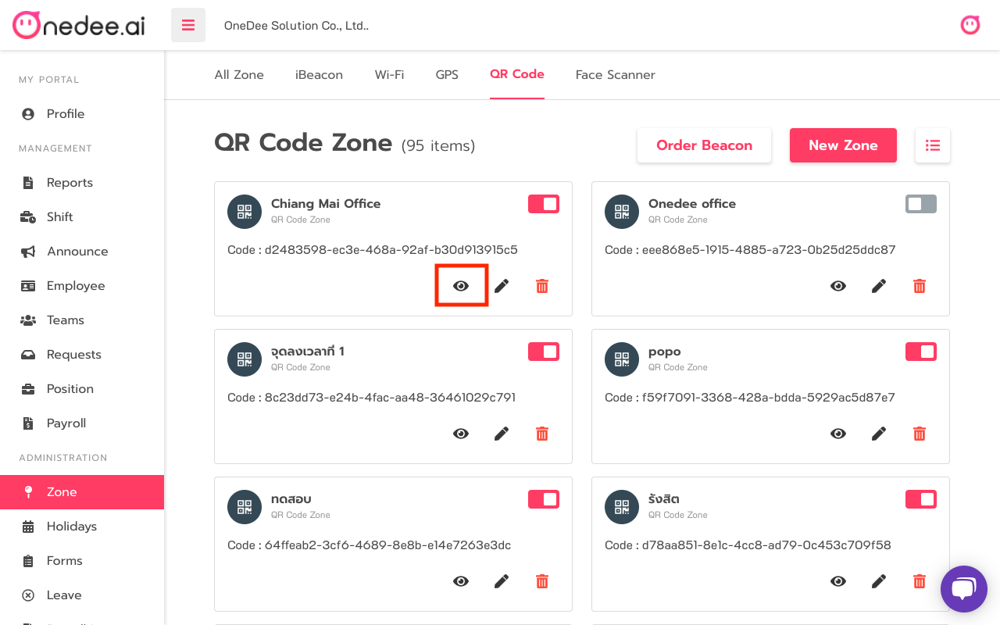
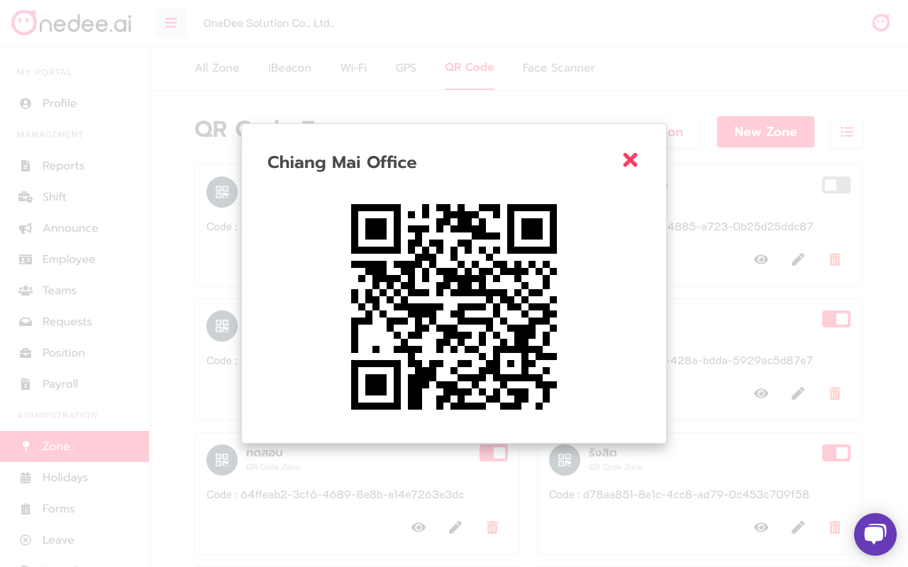

# QR Code



## **How to create** **QR Code**

* Go to **Zone** 
* Click **QR Code**

* Click **New Zone**
* Click **QR Code**

* Enter **Name** you want
* Click **Create**

* Click icon "**eye**" for view **QR Code**

* Click "**X**" for close **QR Code**

