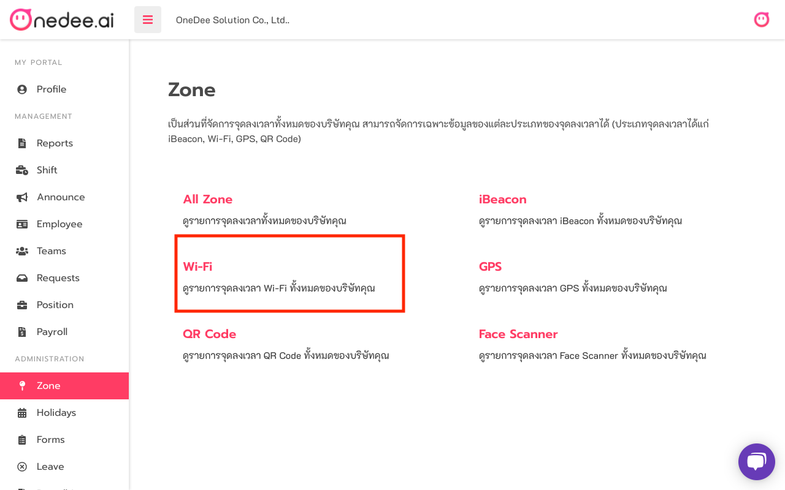
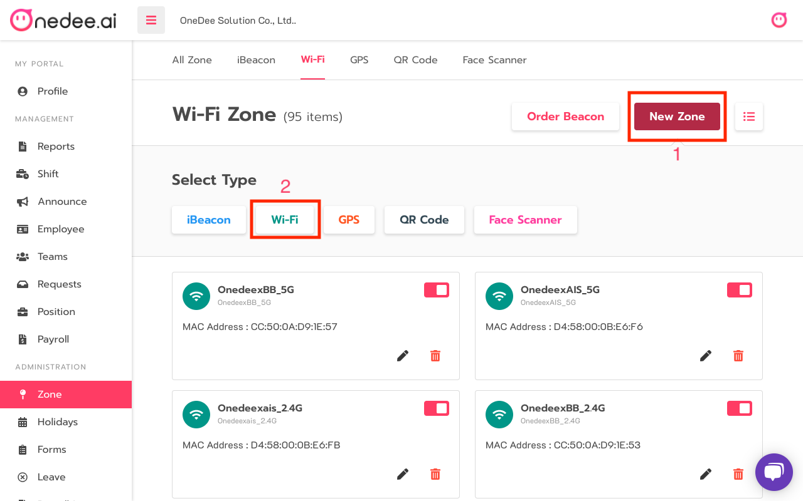
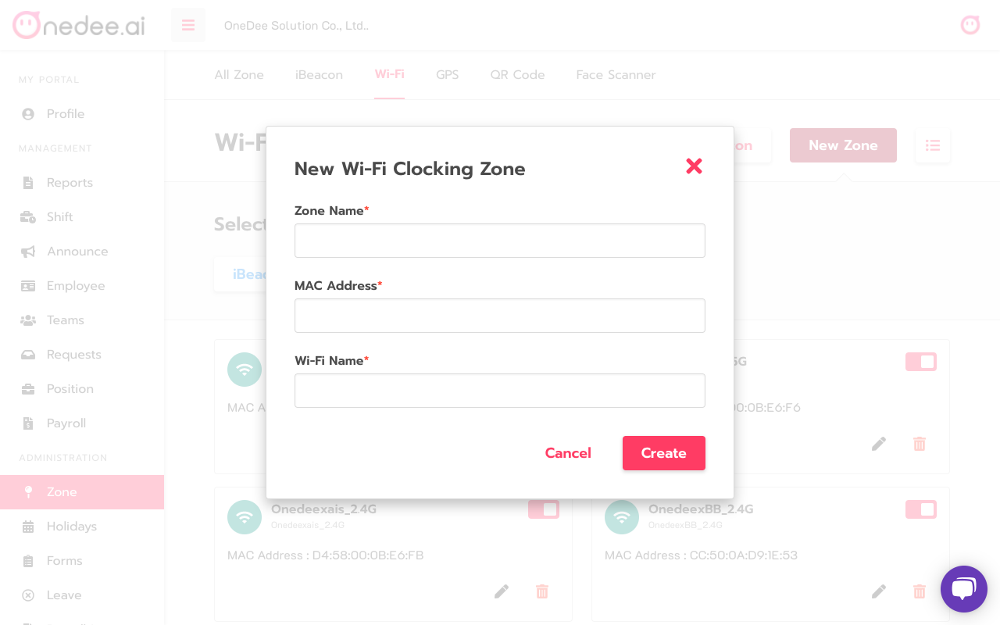

# Wi-Fi



## How to Create Wi-Fi

* Go to **Zone**
* Click **Wi-Fi**

* Click **New Zone**
* Click **Wi-Fi**

* Enter  **Name** you want
* Enter **Mac Address**
* Enter **Wi-Fi Name**
* Click **Create**


**Mac Address** can find on **Router Wi-Fi** or  **WiFi Analyzer** application


